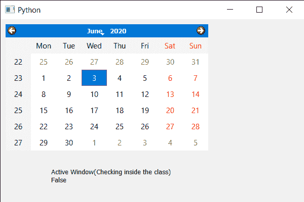

# PyQt5 QCalendarWidget–检查它是否是活动窗口

> 原文:[https://www . geeksforgeeks . org/pyqt 5-qcalendarwidget-检查它是否处于活动状态-窗口打开与否/](https://www.geeksforgeeks.org/pyqt5-qcalendarwidget-checking-if-it-is-active-window-or-not/)

在本文中，我们将看到如何检查 QCalendarWidget 是否是一个活动窗口。活动窗口是具有键盘输入焦点的可见顶层窗口。使其成为活动窗口会将包含此日历的顶层小部件设置为活动窗口。我们可以借助 activateWindow 方法使它成为一个活动窗口。
**注意:**这个方法应该在主窗口类外调用，否则总是返回 false

> 为此，我们将对 QCalendarWidget 对象使用 isActivateWindow 方法。
> **语法:**calendar . isactivatewall()
> **参数:**不需要参数
> **执行的动作:**它返回 bool

下面是实现

## 蟒蛇 3

```
# importing libraries
from PyQt5.QtWidgets import *
from PyQt5 import QtCore, QtGui
from PyQt5.QtGui import *
from PyQt5.QtCore import *
import sys

class Window(QMainWindow):

    def __init__(self):
        super().__init__()

        # setting title
        self.setWindowTitle("Python ")

        # setting geometry
        self.setGeometry(100, 100, 600, 400)

        # calling method
        self.UiComponents()

        # showing all the widgets
        self.show()

    # method for components
    def UiComponents(self):

        # creating a QCalendarWidget object
        self.calendar = QCalendarWidget(self)

        # setting geometry to the calendar
        self.calendar.setGeometry(10, 10, 400, 250)

        # setting name
        self.calendar.setAccessibleName("Geek Calendar")

        # making it an active window
        self.calendar.activateWindow()

        # creating a label
        label = QLabel(self)

        # setting geometry to the label
        label.setGeometry(100, 280, 250, 60)

        # making label multi line
        label.setWordWrap(True)

        # checking active window
        value = self.calendar.isActiveWindow()

        # setting text to the label
        label.setText("Active Window(Checking inside the class) " + str(value))

# create pyqt5 app
App = QApplication(sys.argv)

# create the instance of our Window
window = Window()

# checking if active window
# outside the class
check = window.calendar.isActiveWindow()
print("Active window : " + str(check))

# start the app
sys.exit(App.exec())
```

**输出:**

```
Active window : True
```

