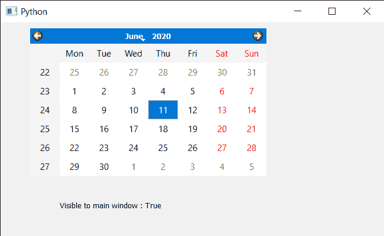

# PyQt5 QCalendarWidget–检查其祖先是否可见

> 原文:[https://www . geeksforgeeks . org/pyqt 5-qcalendarwidget-检查其祖先是否可见/](https://www.geeksforgeeks.org/pyqt5-qcalendarwidget-checking-if-it-is-visible-to-its-ancestor/)

在本文中，我们将看到如何检查 QCalendarWidget 是否对其祖先可见。为了做到这一点，我们使用`isVisibleTo`方法。如果显示祖先，日历将变得可见，则此方法返回 true 否则返回 false。如果日历本身或除祖先之外的任何父级都没有被显式隐藏，就会出现这种情况。

> 为此，我们将对 QCalendarWidget 对象使用`isVisibleTo`方法。
> 
> **语法:** calendar.isVisibleTo(父)
> 
> **参数:**它以 QWidget 对象为参数
> 
> **返回:**返回 bool

下面是实现

```py
# importing libraries
from PyQt5.QtWidgets import * 
from PyQt5 import QtCore, QtGui
from PyQt5.QtGui import * 
from PyQt5.QtCore import * 
import sys

class Window(QMainWindow):

    def __init__(self):
        super().__init__()

        # setting title
        self.setWindowTitle("Python ")

        # setting geometry
        self.setGeometry(100, 100, 650, 400)

        # calling method
        self.UiComponents()

        # showing all the widgets
        self.show()

    # method for components
    def UiComponents(self):

        # creating a QCalendarWidget object
        self.calendar = QCalendarWidget(self)

        # setting geometry to the calender
        self.calendar.setGeometry(50, 10, 400, 250)

        # setting cursor
        self.calendar.setCursor(Qt.PointingHandCursor)

        # creating label to show the properties
        self.label = QLabel(self)

        # setting geometry to the label
        self.label.setGeometry(100, 280, 250, 60)

        # making label multi line
        self.label.setWordWrap(True)

        # checking if the calendar is visible to main window
        value = self.calendar.isVisibleTo(self)

        # setting text to the label
        self.label.setText("Visible to main window : " + str(value))

# create pyqt5 app
App = QApplication(sys.argv)

# create the instance of our Window
window = Window()

# start the app
sys.exit(App.exec())
```

**输出:**
