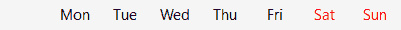
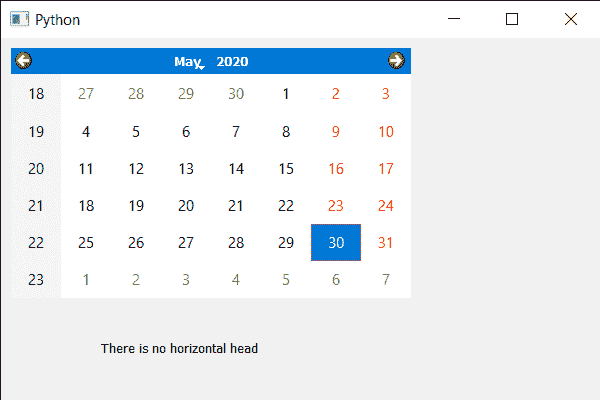

# PyQt5 QCalendarWidget–检查是否有水平表头

> 原文:[https://www . geeksforgeeks . org/pyqt5-qcalendarwidget-checking-如果有-水平-header-or-not/](https://www.geeksforgeeks.org/pyqt5-qcalendarwidget-checking-if-there-is-horizontal-header-or-not/)

在本文中，我们将看到如何检查 QCalendarWidget 是否有水平标题。水平标题是 QCalendarWidget 中显示日期名称的位置，默认情况下显示的是日期的短形式，例如周一显示为周一，下面是水平标题表示。



可以通过覆盖 QCalendarWidget 的结构或通过将标头格式值设置为 0 来移除水平，因此，为了检查是否有标头，我们必须获取标头的值，并与 0 值进行比较，以了解是否有标头。

下面是实现

## 蟒蛇 3

```py
# importing libraries
from PyQt5.QtWidgets import *
from PyQt5 import QtCore, QtGui
from PyQt5.QtGui import *
from PyQt5.QtCore import *
import sys

class Window(QMainWindow):

    def __init__(self):
        super().__init__()

        # setting title
        self.setWindowTitle("Python")

        # setting geometry
        self.setGeometry(100, 100, 600, 400)

        # calling method
        self.UiComponents()

        # showing all the widgets
        self.show()

    # method for components
    def UiComponents(self):

        # creating a QCalendarWidget object
        calender = QCalendarWidget(self)

        # setting geometry to the calender
        calender.setGeometry(10, 10, 400, 250)

        # removing horizontal header
        calender.setHorizontalHeaderFormat(0)

        # creating a label
        label = QLabel(self)

        # setting geometry to the label
        label.setGeometry(100, 280, 250, 60)

        # making label multi line
        label.setWordWrap(True)

        # getting the horizontal header value
        value = calender.horizontalHeaderFormat()

        # text
        text = "There exist horizontal head"

        # comparing value with 0
        if value == 0:
            text = "There is no horizontal head"

        # setting text to the label
        label.setText(text)

# create pyqt5 app
App = QApplication(sys.argv)

# create the instance of our Window
window = Window()

# start the app
sys.exit(App.exec())
```

**输出:**

