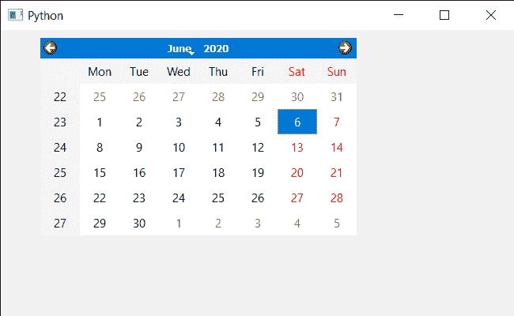

# pyqt 5 qcalendarwdget–转储日历信息

> 原文:[https://www . geesforgeks . org/pyqt 5-qcalendar widget-dump-calendar-info/](https://www.geeksforgeeks.org/pyqt5-qcalendarwidget-dump-calendar-info/)

在本文中，我们将看到如何转储 QCalendarWidget 的对象信息，转储日历信息意味着转储关于信号连接的信息等。调试输出的日历。

> 为此，我们将对 QCalendarWidget 对象使用 dumpObjectInfo 方法。
> **语法:**calendar . dumpobjectinfo()
> **参数:**不需要参数
> **返回:**不返回

下面是实现

## 蟒蛇 3

```
# importing libraries
from PyQt5.QtWidgets import *
from PyQt5 import QtCore, QtGui
from PyQt5.QtGui import *
from PyQt5.QtCore import *
import sys

class Window(QMainWindow):

    def __init__(self):
        super().__init__()

        # setting title
        self.setWindowTitle("Python ")

        # setting geometry
        self.setGeometry(100, 100, 650, 400)

        # calling method
        self.UiComponents()

        # showing all the widgets
        self.show()

    # method for components
    def UiComponents(self):

        # creating a QCalendarWidget object
        self.calendar = QCalendarWidget(self)

        # setting geometry to the calendar
        self.calendar.setGeometry(50, 10, 400, 250)

        # setting cursor
        self.calendar.setCursor(Qt.PointingHandCursor)

        # dumping the object info
        self.calendar.dumpObjectInfo()

# create pyqt5 app
App = QApplication(sys.argv)

# create the instance of our Window
window = Window()
window.calendar.destroy()

# start the app
sys.exit(App.exec())
```

**输出:**

