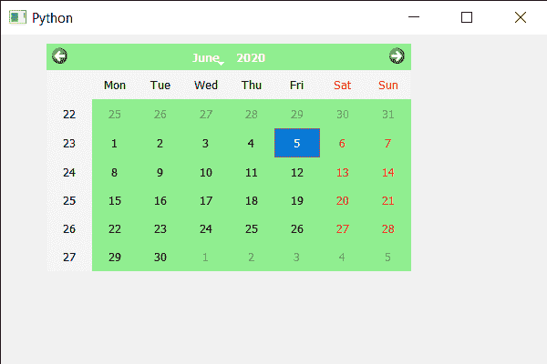

# PyQt5 QCalendarWidget–启用/禁用自动填充背景属性

> 原文:[https://www . geeksforgeeks . org/pyqt 5-qcalendarwidget-启用-禁用-自动填充-后台-属性/](https://www.geeksforgeeks.org/pyqt5-qcalendarwidget-enabling-disabling-auto-fill-background-property/)

在本文中，我们将看到如何启用或禁用 QCalendarWidget 的自动填充属性，该属性将导致 Qt 在调用 paint 事件之前填充日历的背景。使用的颜色由 QPalette 定义。默认情况下，此属性为 false。
该属性应结合 Qt 样式表谨慎处理。当日历的样式表具有有效的背景或边框图像时，此属性会自动禁用。

> 为此，我们将对 QCalendarWidget 对象使用 setAutoFillBackground 方法。
> **语法:**calendar . setautofilbackground(True)
> **参数:**它以 bool 为参数
> **返回:**它不返回

下面是实现

## 蟒蛇 3

```
# importing libraries
from PyQt5.QtWidgets import *
from PyQt5 import QtCore, QtGui
from PyQt5.QtGui import *
from PyQt5.QtCore import *
import sys

class Window(QMainWindow):

    def __init__(self):
        super().__init__()

        # setting title
        self.setWindowTitle("Python ")

        # setting geometry
        self.setGeometry(100, 100, 600, 400)

        # calling method
        self.UiComponents()

        # showing all the widgets
        self.show()

    # method for components
    def UiComponents(self):

        # creating a QCalendarWidget object
        self.calendar = QCalendarWidget(self)

        # setting geometry to the calendar
        self.calendar.setGeometry(50, 10, 400, 250)

        # setting style sheet
        self.calendar.setStyleSheet("background : lightgreen;")

        # enabling auto fill background
        self.calendar.setAutoFillBackground(True)

# create pyqt5 app
App = QApplication(sys.argv)

# create the instance of our Window
window = Window()

# start the app
sys.exit(App.exec())
```

**输出:**

