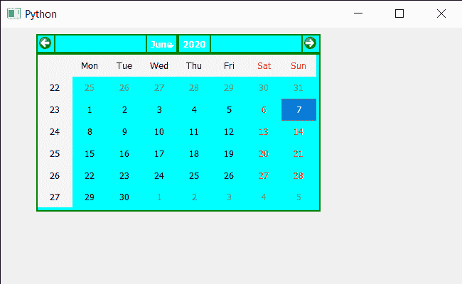

# PyQt5 QCalendarWidget–确保抛光

> 原文:[https://www . geesforgeks . org/pyqt 5-qcalendarwidget-确保-polish/](https://www.geeksforgeeks.org/pyqt5-qcalendarwidget-ensure-polish/)

在本文中，我们将看到如何确保 QCalendarWidget 的完善。日历的润色是通过使用 QStyle 或样式表来完成的。尽管开发人员可以通过使用“确保抛光”方法来确保抛光完成，但抛光是在完成所有编辑后的最后完成的。

> 为了做到这一点，我们将使用带有 QCalendarWidget 对象的 ensurePolished 方法。
> **语法:**日历.保证抛光()
> **参数:**不需要参数
> **返回:**不返回

下面是实现

## 蟒蛇 3

```py
# importing libraries
from PyQt5.QtWidgets import *
from PyQt5 import QtCore, QtGui
from PyQt5.QtGui import *
from PyQt5.QtCore import *
import sys

class Window(QMainWindow):

    def __init__(self):
        super().__init__()

        # setting title
        self.setWindowTitle("Python ")

        # setting geometry
        self.setGeometry(100, 100, 650, 400)

        # calling method
        self.UiComponents()

        # showing all the widgets
        self.show()

    # method for components
    def UiComponents(self):

        # creating a QCalendarWidget object
        self.calendar = QCalendarWidget(self)

        # setting geometry to the calendar
        self.calendar.setGeometry(50, 10, 400, 250)

        # setting cursor
        self.calendar.setCursor(Qt.PointingHandCursor)

        # setting style sheet
        self.calendar.setStyleSheet("border : 2px solid green;"
                                    "background : cyan;")

        # ensuring polish
        self.calendar.ensurePolished()

# create pyqt5 app
App = QApplication(sys.argv)

# create the instance of our Window
window = Window()

# getting system identifier of calendar
identifier = window.calendar.effectiveWinId()

# start the app
sys.exit(App.exec())
```

**输出:**

