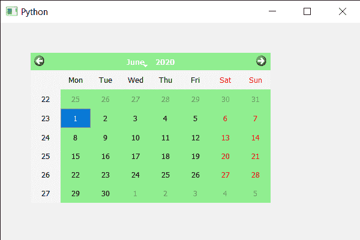

# PyQt5 QCalendarWidget–确保喷漆事件

> 原文:[https://www . geeksforgeeks . org/pyqt 5-qcalendarwidget-insurance-paint-event/](https://www.geeksforgeeks.org/pyqt5-qcalendarwidget-ensuring-paint-event/)

在本文中，我们将看到如何确保 QCalendarWidget 的 paint 事件。在画师事件的帮助下，我们可以按照用户希望的方式绘制日历，但有时需要重新绘制旋转框以确保画师事件的动作。

> 为了做到这一点，我们将使用 QCalendarWidget 对象的重画方法。
> **语法:**calendar . repair()
> **参数:**不需要参数
> **返回:**返回 None

下面是实现

## 蟒蛇 3

```py
# importing libraries
from PyQt5.QtWidgets import *
from PyQt5 import QtCore, QtGui
from PyQt5.QtGui import *
from PyQt5.QtCore import *
import sys

class Window(QMainWindow):

    def __init__(self):
        super().__init__()

        # setting title
        self.setWindowTitle("Python ")

        # setting geometry
        self.setGeometry(100, 100, 600, 400)

        # calling method
        self.UiComponents()

        # showing all the widgets
        self.show()

    # method for components
    def UiComponents(self):

        # creating a QCalendarWidget object
        self.calendar = QCalendarWidget(self)

        # setting geometry to the calendar
        self.calendar.setGeometry(50, 50, 400, 250)

        # setting style sheet
        self.calendar.setStyleSheet("background : lightgreen;")

        # ensuring paint event
        self.calendar.repaint()

# create pyqt5 app
App = QApplication(sys.argv)

# create the instance of our Window
window = Window()

# start the app
sys.exit(App.exec())
```

**输出:**

