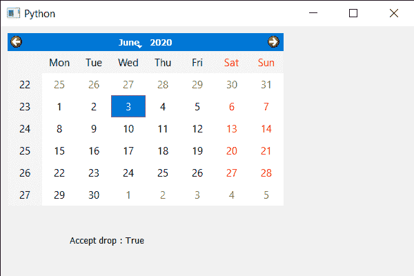

# PyQt5 QcalendarWidget–获取接受滴属性

> 原文:[https://www . geeksforgeeks . org/pyqt 5-qcalendarwidget-get-accept-drops-property/](https://www.geeksforgeeks.org/pyqt5-qcalendarwidget-getting-accept-drops-property/)

在本文中，我们将看到如何获得 QCalendarWidget 的 accept drop 属性。我们知道我们可以使用`setDragEnabled`方法对日历对象启用拖动，但是拖动文本有什么用，我们不能把它放在任何地方。允许接受删除意味着日历现在有一个属性来接受其他日历小部件的删除文本。Accepting drops 用于设置年份，因为它是作为子对象的旋转框对象，默认情况下，该属性为 false，但可以借助`setAcceptDrops`方法进行更改。

> 为此，我们将对 QCalendarWidget 对象使用`acceptDrops`方法。
> 
> **语法:**行事历。acceptdrops()
> 
> **论证:**不需要论证
> 
> **执行的操作:**它返回 bool

下面是实现

```py
# importing libraries
from PyQt5.QtWidgets import * 
from PyQt5 import QtCore, QtGui
from PyQt5.QtGui import * 
from PyQt5.QtCore import * 
import sys

class Window(QMainWindow):

    def __init__(self):
        super().__init__()

        # setting title
        self.setWindowTitle("Python ")

        # setting geometry
        self.setGeometry(100, 100, 600, 400)

        # calling method
        self.UiComponents()

        # showing all the widgets
        self.show()

    # method for components
    def UiComponents(self):

        # creating a QCalendarWidget object
        calender = QCalendarWidget(self)

        # setting geometry to the calender
        calender.setGeometry(10, 10, 400, 250)

        # accepting drops
        calender.setAcceptDrops(True)

        # creating a label
        label = QLabel(self)

        # setting geometry to the label
        label.setGeometry(100, 280, 250, 60)

        # making label multi line
        label.setWordWrap(True)

        # getting accept drops property
        value = calender.acceptDrops()

        # setting text to the label
        label.setText("Accept drop : " + str(value))

# create pyqt5 app
App = QApplication(sys.argv)

# create the instance of our Window
window = Window()

# start the app
sys.exit(App.exec())
```

**输出:**
