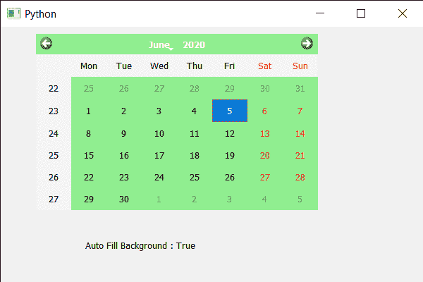

# PyQt5 QCalendarWidget–获取自动填充背景属性

> 原文:[https://www . geeksforgeeks . org/pyqt 5-qcalendarwidget-get-auto-fill-background-property/](https://www.geeksforgeeks.org/pyqt5-qcalendarwidget-getting-auto-fill-background-property/)

在本文中，我们将看到如何获得 QCalendarWidget 的自动填充属性，该属性将导致 Qt 在调用 paint 事件之前填充日历的背景。使用的颜色由 QPalette 定义。默认情况下，该属性为假，可以借助`setAutoFillBackground`方法进行更改。

> 为此，我们将对 QCalendarWidget 对象使用`autoFillBackground`方法。
> 
> **语法:**日历.自动填充背景(真)
> 
> **论证:**不需要论证
> 
> **返回:**返回 bool

下面是实现

```
# importing libraries
from PyQt5.QtWidgets import * 
from PyQt5 import QtCore, QtGui
from PyQt5.QtGui import * 
from PyQt5.QtCore import * 
import sys

class Window(QMainWindow):

    def __init__(self):
        super().__init__()

        # setting title
        self.setWindowTitle("Python ")

        # setting geometry
        self.setGeometry(100, 100, 600, 400)

        # calling method
        self.UiComponents()

        # showing all the widgets
        self.show()

    # method for components
    def UiComponents(self):

        # creating a QCalendarWidget object
        self.calender = QCalendarWidget(self)

        # setting geometry to the calender
        self.calender.setGeometry(50, 10, 400, 250)

        # setting style sheet
        self.calender.setStyleSheet("background : lightgreen;")

        # enabling auto fill background
        self.calender.setAutoFillBackground(True)

        # creating a label
        label = QLabel(self)

        # setting geometry
        label.setGeometry(120, 280, 200, 60)

        # making it multi line
        label.setWordWrap(True)

        # getting the auto fill background property
        value = self.calender.autoFillBackground()

        # setting text to the label
        label.setText("Auto Fill Background : " + str(value))

# create pyqt5 app
App = QApplication(sys.argv)

# create the instance of our Window
window = Window()

# start the app
sys.exit(App.exec())
```

**输出:**
