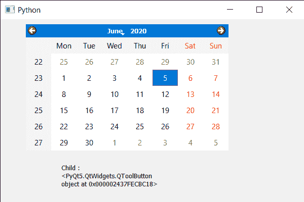

# PyQt5 QCalendarWidget–在给定坐标下获取其子代

> 原文:[https://www . geeksforgeeks . org/pyqt5-qcalendarwidget-get-it 之子-at-given-coordinate/](https://www.geeksforgeeks.org/pyqt5-qcalendarwidget-getting-child-of-it-at-given-co-ordinate/)

在本文中，我们将看到如何在给定的坐标/位置获得 QCalendarWidget 的子对象。日历不是一个单独的小部件，它是许多小部件的混合物，我们称之为日历子部件。有许多子视图，如表视图、项目委托等。

> 为此，我们将对 QCalendarWidget 对象使用 childAt 方法。
> **语法:** calendar.childAt(x，y)
> **自变量:**取两个整数作为自变量
> **返回:**返回给定位置的 calendar 的子代

下面是实现

## 蟒蛇 3

```py
# importing libraries
from PyQt5.QtWidgets import *
from PyQt5 import QtCore, QtGui
from PyQt5.QtGui import *
from PyQt5.QtCore import *
import sys

class Window(QMainWindow):

    def __init__(self):
        super().__init__()

        # setting title
        self.setWindowTitle("Python ")

        # setting geometry
        self.setGeometry(100, 100, 600, 400)

        # calling method
        self.UiComponents()

        # showing all the widgets
        self.show()

    # method for components
    def UiComponents(self):

        # creating a QCalendarWidget object
        self.calendar = QCalendarWidget(self)

        # setting geometry to the calendar
        self.calendar.setGeometry(50, 10, 400, 250)

        # creating a label
        label = QLabel(self)

        # setting geometry
        label.setGeometry(120, 280, 200, 60)

        # making it multi line
        label.setWordWrap(True)

        # getting child at position 10, 10
        value = self.calendar.childAt(10, 10)

        # setting text to the label
        label.setText("Child : " + str(value))

# create pyqt5 app
App = QApplication(sys.argv)

# create the instance of our Window
window = Window()

# start the app
sys.exit(App.exec())
```

**输出:**

