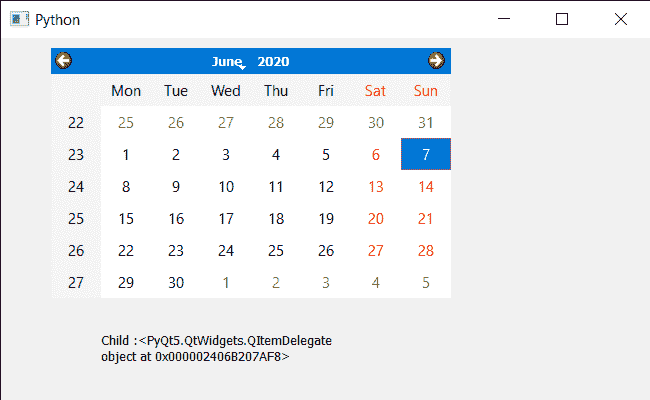

# PyQt5 QCalendarWidget–使用其类型获取子代

> 原文:[https://www . geesforgeks . org/pyqt5-qcalendarwidget-get-child-using-its-type/](https://www.geeksforgeeks.org/pyqt5-qcalendarwidget-getting-child-using-its-type/)

在本文中，我们将看到如何使用子控件的类型找到 QCalendarWidget 的子控件。日历不是一个独立的小部件，它由称为子部件的小部件组成，例如，年份的日期和数字显示框以及月份的下拉菜单共同组成日历

> 为此，我们将对 QCalendarWidget 对象使用`findChild`方法。
> 
> **语法:** calendar.findChild(类型)
> 
> **参数:**它采用子参数的类型
> 
> **返回:**返回子对象

**注意:**如果有多个相同类型的子组件，那么它将返回子堆栈中第一个出现的小组件

下面是实现

```py
# importing libraries
from PyQt5.QtWidgets import * 
from PyQt5 import QtCore, QtGui
from PyQt5.QtGui import * 
from PyQt5.QtCore import * 
import sys

class Window(QMainWindow):

    def __init__(self):
        super().__init__()

        # setting title
        self.setWindowTitle("Python ")

        # setting geometry
        self.setGeometry(100, 100, 650, 400)

        # calling method
        self.UiComponents()

        # showing all the widgets
        self.show()

    # method for components
    def UiComponents(self):

        # creating a QCalendarWidget object
        self.calender = QCalendarWidget(self)

        # setting geometry to the calender
        self.calender.setGeometry(50, 10, 400, 250)

        # setting cursor
        self.calender.setCursor(Qt.PointingHandCursor)

        # creating label to show the properties
        self.label = QLabel(self)

        # setting geometry to the label
        self.label.setGeometry(100, 280, 250, 60)

        # making label multi line
        self.label.setWordWrap(True)

        # getting child through type
        value = self.calender.findChild(QItemDelegate)

        # setting text to the label
        self.label.setText("Child :" + str(value))

# create pyqt5 app
App = QApplication(sys.argv)

# create the instance of our Window
window = Window()

# start the app
sys.exit(App.exec())
```

**输出:**
