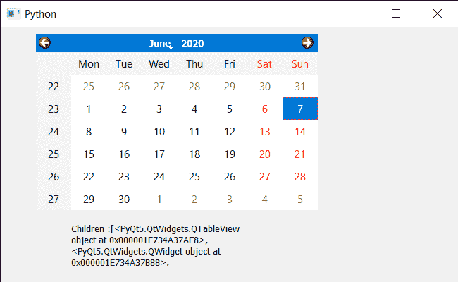

# PyQt5 QCalendarWidget–使用类型

获取孩子

> 原文:[https://www . geesforgeks . org/pyqt5-qcalendarwidget-get-children-use-type/](https://www.geeksforgeeks.org/pyqt5-qcalendarwidget-getting-children-using-the-type/)

在本文中，我们将看到如何使用一个或多个子代的类型找到 QCalendarWidget 的子代。日历不是一个独立的小部件，它由称为子部件的小部件组成，例如年份的日期和数字显示框以及月份的下拉菜单共同组成日历。我们可以在 findChild 方法的帮助下找到使用类型的子代，但是该方法只返回单个小部件，因此如果有多个具有相似类型的子代，那么就会出现问题。

> 为此，我们将使用带有 QCalendarWidget 对象的 findChildren 方法。
> **语法:**calendar . find children(type)
> **引数:**取子引数的 type
> **返回:**返回列表

下面是实现

## 蟒蛇 3

```
# importing libraries
from PyQt5.QtWidgets import *
from PyQt5 import QtCore, QtGui
from PyQt5.QtGui import *
from PyQt5.QtCore import *
import sys

class Window(QMainWindow):

    def __init__(self):
        super().__init__()

        # setting title
        self.setWindowTitle("Python ")

        # setting geometry
        self.setGeometry(100, 100, 650, 400)

        # calling method
        self.UiComponents()

        # showing all the widgets
        self.show()

    # method for components
    def UiComponents(self):

        # creating a QCalendarWidget object
        self.calendar = QCalendarWidget(self)

        # setting geometry to the calendar
        self.calendar.setGeometry(50, 10, 400, 250)

        # setting cursor
        self.calendar.setCursor(Qt.PointingHandCursor)

        # creating label to show the properties
        self.label = QLabel(self)

        # setting geometry to the label
        self.label.setGeometry(100, 280, 250, 60)

        # making label multi line
        self.label.setWordWrap(True)

        # getting children through type
        value = self.calendar.findChildren(QWidget)

        # setting text to the label
        self.label.setText("Children :" + str(value))

# create pyqt5 app
App = QApplication(sys.argv)

# create the instance of our Window
window = Window()

# start the app
sys.exit(App.exec())
```

**输出:**

