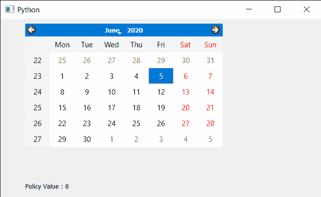

# PyQt5 QCalendarWidget–获取其上下文菜单策略

> 原文:[https://www . geeksforgeeks . org/pyqt5-qcalendarwidget-get-context-menu-policy-of-it/](https://www.geeksforgeeks.org/pyqt5-qcalendarwidget-getting-context-menu-policy-of-it/)

在本文中，我们将看到如何获取 QCalendarWidget 的上下文菜单策略。上下文菜单策略告诉日历如何显示上下文菜单，有许多策略可用于日历，如 NoContextMenu、PreventContextMenu 等。默认情况下，日历使用 DefaultContextMenu 作为上下文策略，尽管我们可以在 setContextMenuPolicy 方法的帮助下对此进行更改。

> 为此，我们将对 QCalendarWidget 对象使用 contextMenuPolicy 方法。
> **语法:**calendar . contextmenuppolicy()
> **参数:**不需要参数
> **Return :** 它返回 Content Menu Policy 对象，但在打印时会显示策略的关联值。

下面是实现

## 蟒蛇 3

```py
# importing libraries
from PyQt5.QtWidgets import *
from PyQt5 import QtCore, QtGui
from PyQt5.QtGui import *
from PyQt5.QtCore import *
import sys

class Window(QMainWindow):

    def __init__(self):
        super().__init__()

        # setting title
        self.setWindowTitle("Python ")

        # setting geometry
        self.setGeometry(100, 100, 650, 400)

        # calling method
        self.UiComponents()

        # showing all the widgets
        self.show()

    # method for components
    def UiComponents(self):

        # creating a QCalendarWidget object
        self.calendar = QCalendarWidget(self)

        # setting geometry to the calendar
        self.calendar.setGeometry(50, 10, 400, 250)

        # setting context menu policy
        self.calendar.setContextMenuPolicy(Qt.NoContextMenu)

        # creating a label
        label = QLabel(self)

        # setting geometry
        label.setGeometry(50, 280, 420, 120)

        # making it multi line
        label.setWordWrap(True)

        # getting context menu policy
        value = self.calendar.contextMenuPolicy()

        # setting text to the label
        label.setText("Policy Value : " + str(value))

# create pyqt5 app
App = QApplication(sys.argv)

# create the instance of our Window
window = Window()

# start the app
sys.exit(App.exec())
```

**输出:**

