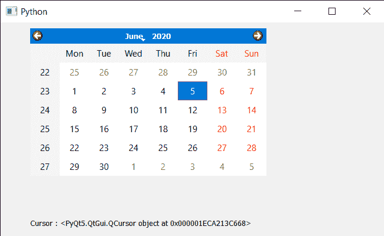

# PyQt5 QCalendarWidget–获取光标形状

> 原文:[https://www . geeksforgeeks . org/pyqt 5-qcalendarwidget-get-cursor-shape/](https://www.geeksforgeeks.org/pyqt5-qcalendarwidget-getting-cursor-shape/)

在本文中，我们将看到如何获得 QCalendarWidget 的光标形状。光标是默认光标形状的鼠标指针，也就是说，尽管日历有各种各样的光标可用，例如，拆分光标、大小光标等，但窗口或日历的光标看起来是相同的。默认情况下，它有箭头光标，但可以通过 setCursor 方法进行更改。

> 为此，我们将对 QCalendarWidget 对象使用游标方法。
> **语法:** calendar.cursor()
> **参数:**不需要参数
> **返回:**返回 QCursor 对象

下面是实现

## 蟒蛇 3

```
# importing libraries
from PyQt5.QtWidgets import *
from PyQt5 import QtCore, QtGui
from PyQt5.QtGui import *
from PyQt5.QtCore import *
import sys

class Window(QMainWindow):

    def __init__(self):
        super().__init__()

        # setting title
        self.setWindowTitle("Python ")

        # setting geometry
        self.setGeometry(100, 100, 650, 400)

        # calling method
        self.UiComponents()

        # showing all the widgets
        self.show()

    # method for components
    def UiComponents(self):

        # creating a QCalendarWidget object
        self.calendar = QCalendarWidget(self)

        # setting geometry to the calendar
        self.calendar.setGeometry(50, 10, 400, 250)

        # setting cursor
        self.calendar.setCursor(Qt.PointingHandCursor)

        # creating a label
        label = QLabel(self)

        # setting geometry
        label.setGeometry(50, 280, 420, 120)

        # making it multi line
        label.setWordWrap(True)

        # getting cursor
        value = self.calender.cursor()

        # setting text to the label
        label.setText("Cursor : " + str(value))

# create pyqt5 app
App = QApplication(sys.argv)

# create the instance of our Window
window = Window()

# start the app
sys.exit(App.exec())
```

**输出:**

