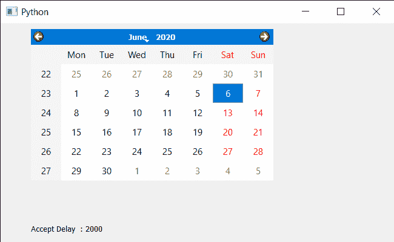

# PyQt5 QCalendarWidget–获取日期编辑(弹出)接受延迟

> 原文:[https://www . geesforgeks . org/pyqt5-qcalendarwidget-get-date-edit-pop-accept-delay/](https://www.geeksforgeeks.org/pyqt5-qcalendarwidget-getting-date-edit-pop-up-accept-delay/)

在本文中，我们将看到如何获得 QCalendarWidget 的日期编辑接受延迟属性。此属性保存非活动日期编辑在内容被接受之前显示的时间。如果启用了日历小部件的日期编辑，此属性指定在最近一次用户输入后日期编辑保持打开的时间(以毫秒为单位)。一旦这段时间过去，日期编辑中指定的日期被接受，弹出窗口关闭。默认情况下，延迟定义为 1500 毫秒(1.5 秒)。

当我们尝试使用键盘选择时，会出现日期编辑弹出窗口，延迟弹出窗口的值越小，关闭得越快。可以借助 setDateEditAcceptDelay 方法进行设置。

> 为此，我们将对 QCalendarWidget 对象使用 dateEditAcceptDelay 方法。
> **语法:**calendar . dateditacceptdelay()
> **参数:**不需要参数
> **返回:**返回整数

下面是实现

## 蟒蛇 3

```py
# importing libraries
from PyQt5.QtWidgets import * 
from PyQt5 import QtCore, QtGui
from PyQt5.QtGui import * 
from PyQt5.QtCore import * 
import sys

class Window(QMainWindow):

    def __init__(self):
        super().__init__()

        # setting title
        self.setWindowTitle("Python ")

        # setting geometry
        self.setGeometry(100, 100, 650, 400)

        # calling method
        self.UiComponents()

        # showing all the widgets
        self.show()

    # method for components
    def UiComponents(self):

        # creating a QCalendarWidget object
        self.calender = QCalendarWidget(self)

        # setting geometry to the calendar
        self.calender.setGeometry(50, 10, 400, 250)

        # setting cursor
        self.calender.setCursor(Qt.PointingHandCursor)

        # removing special cursor
        self.calender.unsetCursor()

        # setting accept delay value
        self.calender.setDateEditAcceptDelay(2000)

        # creating a label
        label = QLabel(self)

        # setting geometry
        label.setGeometry(50, 280, 420, 120)

        # making it multi line
        label.setWordWrap(True)

        # getting delay time in pop-up
        value = self.calender.dateEditAcceptDelay()

        # setting text to the label
        label.setText("Accept Delay  : " + str(value))

# create pyqt5 app
App = QApplication(sys.argv)

# create the instance of our Window
window = Window()

# start the app
sys.exit(App.exec())
```

**输出:**

