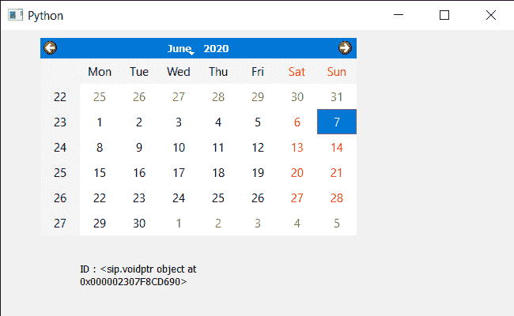

# PyQt5 QCalendarWidget–获取有效 ID

> 原文:[https://www . geeksforgeeks . org/pyqt 5-qcalendarwidget-get-effect-id/](https://www.geeksforgeeks.org/pyqt5-qcalendarwidget-getting-effective-id/)

在本文中我们将看到如何获取 QCalendarWidget 的有效 id，有效 ID 是日历的窗口系统标识符。有效标识符是指日历的本地父窗口系统标识符。
**注 1:** 建议不要存储该值，因为它可能会在运行时发生变化。

> 为此，我们将对 QCalendarWidget 对象使用 effectiveWinId 方法。
> **语法:**calendar . effectiveweid()
> **参数:**不需要参数
> **返回:**返回原生日历 ID

**注 2:** 此方法应在主窗口打开后即主窗口类外调用
下面是实现

## 蟒蛇 3

```py
# importing libraries
from PyQt5.QtWidgets import *
from PyQt5 import QtCore, QtGui
from PyQt5.QtGui import *
from PyQt5.QtCore import *
import sys

class Window(QMainWindow):

    def __init__(self):
        super().__init__()

        # setting title
        self.setWindowTitle("Python ")

        # setting geometry
        self.setGeometry(100, 100, 650, 400)

        # calling method
        self.UiComponents()

        # showing all the widgets
        self.show()

    # method for components
    def UiComponents(self):

        # creating a QCalendarWidget object
        self.calendar = QCalendarWidget(self)

        # setting geometry to the calendar
        self.calendar.setGeometry(50, 10, 400, 250)

        # setting cursor
        self.calendar.setCursor(Qt.PointingHandCursor)

        # setting properties
        self.calendar.setProperty("Blocked", 0)

        # setting properties
        self.calendar.setProperty("Highlighted dates : ", 0)

        # creating label to show the properties
        self.label = QLabel(self)

        # setting geometry to the label
        self.label.setGeometry(100, 280, 250, 60)

        # making label multi line
        self.label.setWordWrap(True)

# create pyqt5 app
App = QApplication(sys.argv)

# create the instance of our Window
window = Window()

# getting system identifier of calendar
identifier = window.calendar.effectiveWinId()

# setting this text to the label
window.label.setText("ID : " + str(identifier))

# start the app
sys.exit(App.exec())
```

**输出:**

