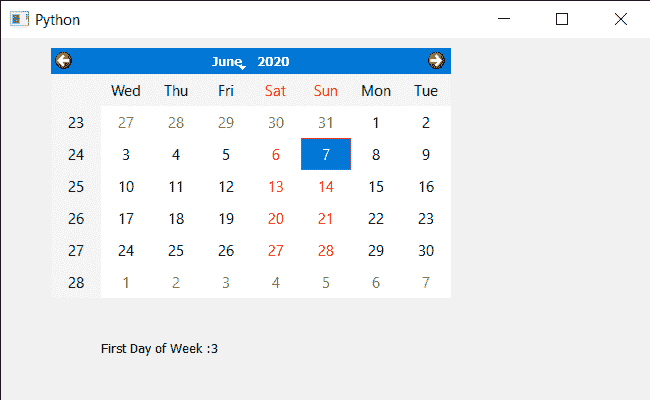

# PyQt5 QCalendarWidget–获取一周的第一天

> 原文:[https://www . geeksforgeeks . org/pyqt 5-qcalendarwidget-get-周首日/](https://www.geeksforgeeks.org/pyqt5-qcalendarwidget-getting-first-day-of-week/)

在本文中，我们将看到如何获得 QCalendarWidget 一周的第一天。默认情况下，当我们创建日历时，一周的第一天是星期一，尽管我们可以随时更改，但日期会显示在日历的第一列。借助 setFirstDayOfWeek 方法，我们可以随时更改第一天。

> 为此，我们将对 QCalendarWidget 对象使用 firstDayOfWeek 方法。
> 
> **语法:**calendar . first day fweek()
> **参数:**不需要参数
> **Return :** 它返回日对象，但打印时会显示与之关联的值

下面是实现

## 蟒蛇 3

```
# importing libraries
from PyQt5.QtWidgets import *
from PyQt5 import QtCore, QtGui
from PyQt5.QtGui import *
from PyQt5.QtCore import *
import sys

class Window(QMainWindow):

    def __init__(self):
        super().__init__()

        # setting title
        self.setWindowTitle("Python ")

        # setting geometry
        self.setGeometry(100, 100, 650, 400)

        # calling method
        self.UiComponents()

        # showing all the widgets
        self.show()

    # method for components
    def UiComponents(self):

        # creating a QCalendarWidget object
        self.calendar = QCalendarWidget(self)

        # setting geometry to the calendar
        self.calendar.setGeometry(50, 10, 400, 250)

        # setting cursor
        self.calendar.setCursor(Qt.PointingHandCursor)

        # setting first day of week
        self.calendar.setFirstDayOfWeek(Qt.Wednesday)

        # creating label to show the properties
        self.label = QLabel(self)

        # setting geometry to the label
        self.label.setGeometry(100, 280, 250, 60)

        # making label multi line
        self.label.setWordWrap(True)

        # getting first day of the week
        value = self.calendar.firstDayOfWeek()

        # setting text to the label
        self.label.setText("First Day of Week :" + str(value))

# create pyqt5 app
App = QApplication(sys.argv)

# create the instance of our Window
window = Window()

# start the app
sys.exit(App.exec())
```

**输出:**

