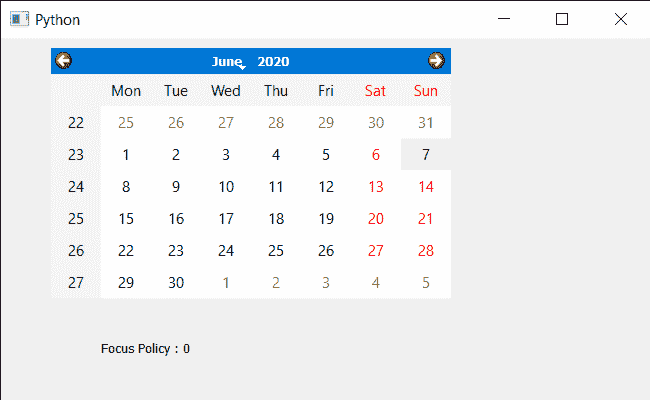

# PyQt5 QCalendarWidget–获取焦点策略

> 原文:[https://www . geeksforgeeks . org/pyqt 5-qcalendarwidget-get-focus-policy/](https://www.geeksforgeeks.org/pyqt5-qcalendarwidget-getting-focus-policy/)

在本文中，我们将看到如何获得 QCalendarWidget 的焦点策略。该属性保持小部件接受键盘焦点的方式，有许多焦点策略可用于日历，如无焦点、强焦点、滚轮焦点等。借助 setFocusPolicy 方法
，我们可以随时更改焦点策略

> 为此，我们将对 QCalendarWidget 对象使用 focusPolicy 方法。
> **语法:**calendar . focus policy()
> **参数:**不需要参数
> **返回:**返回焦点策略对象，但打印时显示与策略关联的值

下面是实现

## 蟒蛇 3

```
# importing libraries
from PyQt5.QtWidgets import *
from PyQt5 import QtCore, QtGui
from PyQt5.QtGui import *
from PyQt5.QtCore import *
import sys

class Window(QMainWindow):

    def __init__(self):
        super().__init__()

        # setting title
        self.setWindowTitle("Python ")

        # setting geometry
        self.setGeometry(100, 100, 650, 400)

        # calling method
        self.UiComponents()

        # showing all the widgets
        self.show()

    # method for components
    def UiComponents(self):

        # creating a QCalendarWidget object
        self.calendar = QCalendarWidget(self)

        # setting geometry to the calendar
        self.calendar.setGeometry(50, 10, 400, 250)

        # setting cursor
        self.calendar.setCursor(Qt.PointingHandCursor)

        # setting focus policy to calendar
        # as no focus is set keyboard input will not work
        self.calendar.setFocusPolicy(Qt.NoFocus)

        # creating label to show the properties
        self.label = QLabel(self)

        # setting geometry to the label
        self.label.setGeometry(100, 280, 250, 60)

        # making label multi line
        self.label.setWordWrap(True)

        # getting focus policy
        value = self.calendar.focusPolicy()

        # setting text to the label
        self.label.setText("Focus Policy : " + str(value))

# create pyqt5 app
App = QApplication(sys.argv)

# create the instance of our Window
window = Window()

# start the app
sys.exit(App.exec())
```

**输出:**

