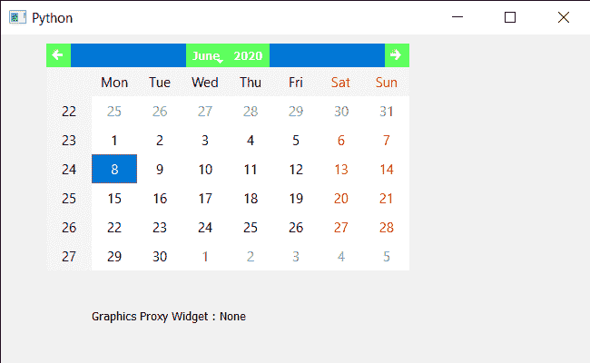

# PyQt5 QCalendarWidget–获取图形代理 Widget 属性

> 原文:[https://www . geeksforgeeks . org/pyqt5-qcalendarwidget-get-graphics-proxy-widget-property/](https://www.geeksforgeeks.org/pyqt5-qcalendarwidget-getting-graphics-proxy-widget-property/)

在本文中，我们将看到如何获得 QCalendarWidget 的图形代理小部件。图形代理小部件在图形视图中返回相应嵌入式小部件的代理小部件；否则返回无。

> 为此，我们将对 QCalendarWidget 对象使用`graphicsProxyWidget`方法。
> 
> **语法:**calendar . graphicsproxywidget()
> 
> **论证:**不需要论证
> 
> **返回:**返回 QWidget 对象

下面是实现

```
# importing libraries
from PyQt5.QtWidgets import * 
from PyQt5 import QtCore, QtGui
from PyQt5.QtGui import * 
from PyQt5.QtCore import * 
import sys

class Window(QMainWindow):

    def __init__(self):
        super().__init__()

        # setting title
        self.setWindowTitle("Python ")

        # setting geometry
        self.setGeometry(100, 100, 650, 400)

        # calling method
        self.UiComponents()

        # showing all the widgets
        self.show()

    # method for components
    def UiComponents(self):

        # creating a QCalendarWidget object
        self.calendar = QCalendarWidget(self)

        # setting geometry to the calender
        self.calendar.setGeometry(50, 10, 400, 250)

        # setting cursor
        self.calendar.setCursor(Qt.PointingHandCursor)

        # creating a color graphic effect
        color = QGraphicsColorizeEffect()
        color.setColor(Qt.green)

        # setting graphics to the calendar
        self.calendar.setGraphicsEffect(color)

        # creating label to show the properties
        self.label = QLabel(self)

        # setting geometry to the label
        self.label.setGeometry(100, 280, 250, 60)

        # making label multi line
        self.label.setWordWrap(True)

        # getting graphics proxy widget if there is any
        value = self.calendar.graphicsProxyWidget()

        # setting text to the label
        self.label.setText("Graphics Proxy Widget : " + str(value))

# create pyqt5 app
App = QApplication(sys.argv)

# create the instance of our Window
window = Window()

# start the app
sys.exit(App.exec())
```

**输出:**
