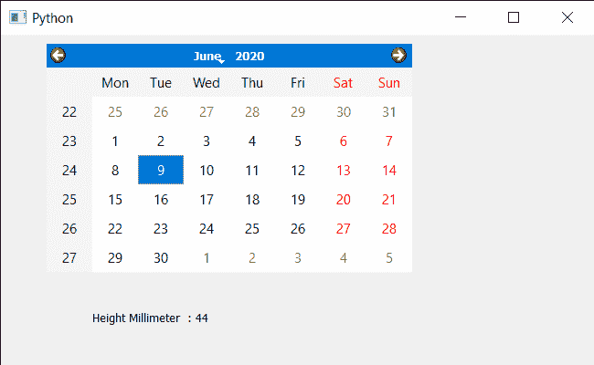

# PyQt5 QCalendarWidget–以毫米为单位获取高度

> 原文:[https://www . geeksforgeeks . org/pyqt 5-qcalendarwidget-以毫米为单位获取高度/](https://www.geeksforgeeks.org/pyqt5-qcalendarwidget-getting-height-in-millimeter/)

在本文中，我们将看到如何获得以毫米为单位的 QCalendarWidget 的高度。为了做到这一点，我们使用`heightMM`方法返回油漆装置的高度，单位为毫米。由于平台限制，可能无法使用此功能来确定小部件在屏幕上的实际物理大小。

> 为此，我们将对 QCalendarWidget 对象使用`heightMM`方法。
> 
> **语法:** calendar.heightMM()
> 
> **论证:**不需要论证
> 
> **返回:**返回整数

下面是实现

```
# importing libraries
from PyQt5.QtWidgets import * 
from PyQt5 import QtCore, QtGui
from PyQt5.QtGui import * 
from PyQt5.QtCore import * 
import sys

class Window(QMainWindow):

    def __init__(self):
        super().__init__()

        # setting title
        self.setWindowTitle("Python ")

        # setting geometry
        self.setGeometry(100, 100, 650, 400)

        # calling method
        self.UiComponents()

        # showing all the widgets
        self.show()

    # method for components
    def UiComponents(self):

        # creating a QCalendarWidget object
        self.calendar = QCalendarWidget(self)

        # setting geometry to the calender
        self.calendar.setGeometry(50, 10, 400, 250)

        # setting cursor
        self.calendar.setCursor(Qt.PointingHandCursor)

        # creating label to show the properties
        self.label = QLabel(self)

        # setting geometry to the label
        self.label.setGeometry(100, 280, 250, 60)

        # making label multi line
        self.label.setWordWrap(True)

        # getting height in millimeter
        value = self.calendar.heightMM()

        # setting text to the label
        self.label.setText("Height Millimeter  : " + str(value))

# create pyqt5 app
App = QApplication(sys.argv)

# create the instance of our Window
window = Window()

# start the app
sys.exit(App.exec())
```

**输出:**
