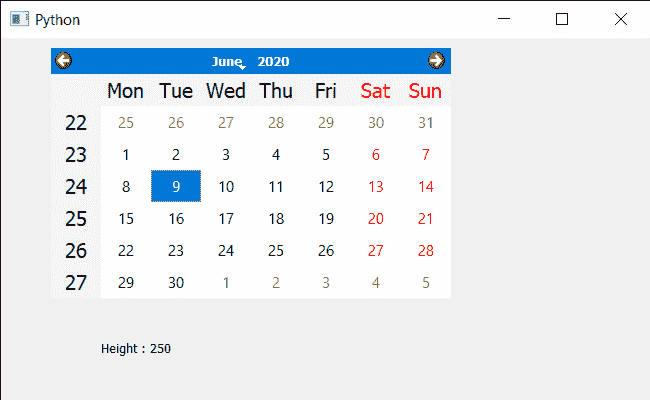

# PyQt5 QCalendarWidget–获取高度

> 原文:[https://www . geeksforgeeks . org/pyqt 5-qcalendarwidget-get-height-it/](https://www.geeksforgeeks.org/pyqt5-qcalendarwidget-getting-height-of-it/)

在本文中，我们将看到如何获得 QCalendarWidget 的高度。为了获得高度，我们使用`height`属性，该属性保存除任何窗口框架之外的小部件的高度。默认情况下，此属性包含一个值，该值取决于用户的平台和屏幕几何形状。

> 为此，我们将对 QCalendarWidget 对象使用`height`方法。
> 
> **语法:** calendar.height()
> 
> **论证:**不需要论证
> 
> **返回:**返回整数

下面是实现

```py
# importing libraries
from PyQt5.QtWidgets import * 
from PyQt5 import QtCore, QtGui
from PyQt5.QtGui import * 
from PyQt5.QtCore import * 
import sys

class Window(QMainWindow):

    def __init__(self):
        super().__init__()

        # setting title
        self.setWindowTitle("Python ")

        # setting geometry
        self.setGeometry(100, 100, 650, 400)

        # calling method
        self.UiComponents()

        # showing all the widgets
        self.show()

    # method for components
    def UiComponents(self):

        # creating a QCalendarWidget object
        self.calendar = QCalendarWidget(self)

        # setting geometry to the calender
        self.calendar.setGeometry(50, 10, 400, 250)

        # setting cursor
        self.calendar.setCursor(Qt.PointingHandCursor)

        # format
        format = QTextCharFormat()
        format.setFont(QFont('Times', 12))

        # setting header text format
        self.calendar.setHeaderTextFormat(format)

        # creating label to show the properties
        self.label = QLabel(self)

        # setting geometry to the label
        self.label.setGeometry(100, 280, 250, 60)

        # making label multi line
        self.label.setWordWrap(True)

        # getting height of the calendar
        value = self.calendar.height()

        # setting text to the label
        self.label.setText("Height : " + str(value))

# create pyqt5 app
App = QApplication(sys.argv)

# create the instance of our Window
window = Window()

# start the app
sys.exit(App.exec())
```

**输出:**
