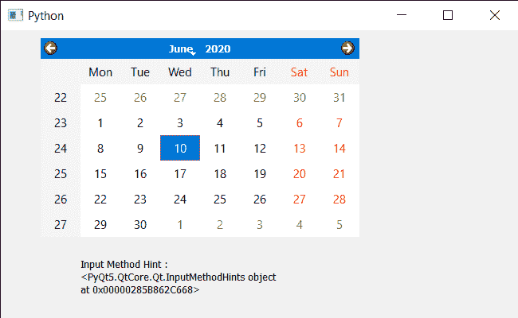

# PyQt5 QCalendarWidget–获取输入法提示属性

> 原文:[https://www . geeksforgeeks . org/pyqt 5-qcalendarwidget-get-input-method-tips-property/](https://www.geeksforgeeks.org/pyqt5-qcalendarwidget-getting-input-method-hints-property/)

在本文中，我们将看到如何获得 QCalendarWidget 的输入法属性。输入法提示由输入法用来检索关于输入法应该如何操作的提示。例如，如果 Qt。ImhFormattedNumbersOnly 如果设置了一个标志，输入法可能会更改其视觉组件，以反映日历小部件中只能输入数字。为了设置输入法属性，我们使用`setInputMethodHints`方法。

> 为此，我们将对 QCalendarWidget 对象使用`inputMethodHints`方法。
> 
> **语法:**calendar . inputmethod tiples()
> 
> **论证:**不需要论证
> 
> **返回:**返回方法提示对象作为参数

下面是实现

```
# importing libraries
from PyQt5.QtWidgets import * 
from PyQt5 import QtCore, QtGui
from PyQt5.QtGui import * 
from PyQt5.QtCore import * 
import sys

class Window(QMainWindow):

    def __init__(self):
        super().__init__()

        # setting title
        self.setWindowTitle("Python ")

        # setting geometry
        self.setGeometry(100, 100, 650, 400)

        # calling method
        self.UiComponents()

        # showing all the widgets
        self.show()

    # method for components
    def UiComponents(self):

        # creating a QCalendarWidget object
        self.calendar = QCalendarWidget(self)

        # setting geometry to the calender
        self.calendar.setGeometry(50, 10, 400, 250)

        # setting cursor
        self.calendar.setCursor(Qt.PointingHandCursor)

        # setting input method hint     
        self.calendar.setInputMethodHints(Qt.ImhPreferNumbers)

        # creating label to show the properties
        self.label = QLabel(self)

        # setting geometry to the label
        self.label.setGeometry(100, 280, 250, 60)

        # making label multi line
        self.label.setWordWrap(True)

        # getting input method hint
        value = self.calendar.inputMethodHints()

        # setting text to the label
        self.label.setText("Input Method Hint : " + str(value))

# create pyqt5 app
App = QApplication(sys.argv)

# create the instance of our Window
window = Window()

# start the app
sys.exit(App.exec())
```

**输出:**
