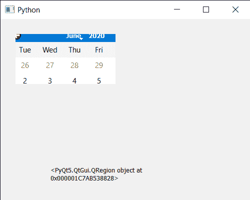

# pyqt 5 qcalendar 预算–上传面具

> 原文:[https://www . geeksforgeeks . org/pyqt 5-qcalendarwidget-get-mask/](https://www.geeksforgeeks.org/pyqt5-qcalendarwidget-getting-mask/)

在本文中，我们将看到如何获得 QCalendarWidget 的掩码。蒙版基本上都是用来隐藏日历的，借助蒙版用户将无法看到整个日历虽然日历还会存在但上面会有蒙版。我们可以借助`setMask`方法给日历设置蒙版。

> 为此，我们将对 QCalendarWidget 对象使用`mask`方法。
> 
> **语法:** calendar.mask()
> 
> **论证:**不需要论证
> 
> **返回:**返回区域对象

下面是实现

```
# importing libraries
from PyQt5.QtWidgets import * 
from PyQt5 import QtCore, QtGui
from PyQt5.QtGui import * 
from PyQt5.QtCore import * 
import sys

# QCalendarWidget Class
class Calendar(QCalendarWidget):

    # constructor
    def __init__(self, parent = None):
        super(Calendar, self).__init__(parent)
        self.setMouseTracking(True)

class Window(QMainWindow):

    def __init__(self):
        super().__init__()

        # setting title
        self.setWindowTitle("Python ")

        # setting geometry
        self.setGeometry(100, 100, 500, 400)

        # calling method
        self.UiComponents()

        # showing all the widgets
        self.show()

    # method for components
    def UiComponents(self):

        # creating a QCalendarWidget object
        # as Calendar class inherits QCalendarWidget
        self.calendar = Calendar(self)

        # setting cursor
        self.calendar.setCursor(Qt.PointingHandCursor)

        # setting geometry to the calendar
        self.calendar.setGeometry(20, 20, 300, 240)

        # QRect object
        rect = QRect(10, 10, 200, 100)

        # creating a QRegion
        region = QRegion(rect)

        # setting mask to the calendar
        self.calendar.setMask(region)

        # creating a label
        label = QLabel(self)

        # setting geometry to the label
        label.setGeometry(100, 280, 300, 60)

        # creating label multi line
        label.setWordWrap(True)

        # getting mask
        mask = self.calendar.mask()

        # setting text to the label
        label.setText(str(mask))

# create pyqt5 app
App = QApplication(sys.argv)

# create the instance of our Window
window = Window()

# start the app
sys.exit(App.exec())
```

**输出:**
