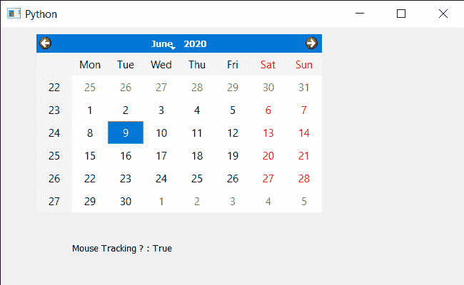

# PyQt5 QCalendarWidget–获取鼠标跟踪属性

> 原文:[https://www . geeksforgeeks . org/pyqt 5-qcalendarwidget-get-mouse-tracking-property/](https://www.geeksforgeeks.org/pyqt5-qcalendarwidget-getting-mouse-tracking-property/)

在本文中，我们将看到如何将鼠标跟踪属性添加到 QCalendarWidget 中。如果禁用鼠标跟踪(默认)，日历将仅在移动鼠标时按下至少一个鼠标按钮时接收鼠标移动事件。如果启用了鼠标跟踪，即使没有按下任何按钮，日历也会接收到鼠标移动事件。我们可以借助`setMouseTracking`方法设置鼠标跟踪属性。

> 为此，我们将对 QCalendarWidget 对象使用`hasMouseTracking`方法。
> 
> **语法:** calendar.hasMouseTracking()
> 
> **论证:**不需要论证
> 
> **返回:**返回 bool

下面是实现

```py
# importing libraries
from PyQt5.QtWidgets import * 
from PyQt5 import QtCore, QtGui
from PyQt5.QtGui import * 
from PyQt5.QtCore import * 
import sys

class Window(QMainWindow):

    def __init__(self):
        super().__init__()

        # setting title
        self.setWindowTitle("Python ")

        # setting geometry
        self.setGeometry(100, 100, 650, 400)

        # calling method
        self.UiComponents()

        # showing all the widgets
        self.show()

    # method for components
    def UiComponents(self):

        # creating a QCalendarWidget object
        self.calendar = QCalendarWidget(self)

        # setting geometry to the calender
        self.calendar.setGeometry(50, 10, 400, 250)

        # setting cursor
        self.calendar.setCursor(Qt.PointingHandCursor)

        # enabling mouse tracking
        self.calendar.setMouseTracking(True)

        # creating label to show the properties
        self.label = QLabel(self)

        # setting geometry to the label
        self.label.setGeometry(100, 280, 250, 60)

        # making label multi line
        self.label.setWordWrap(True)

        # getting mouse tracking
        value = self.calendar.hasMouseTracking()

        # setting text to the label
        self.label.setText("Mouse Tracking ? : " + str(value))

# create pyqt5 app
App = QApplication(sys.argv)

# create the instance of our Window
window = Window()

# start the app
sys.exit(App.exec())
```

**输出:**
