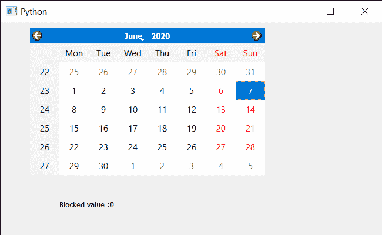

# PyQt5 QCalendarWidget–获取给定名称的属性对应值

> 原文:[https://www . geeksforgeeks . org/pyqt5-qcalendarwidget-get-property-对应-value-for-给定名称/](https://www.geeksforgeeks.org/pyqt5-qcalendarwidget-getting-the-property-corresponding-value-for-given-name/)

在本文中，我们将看到如何在 QCalendarWidget 中获取相应给定名称的属性值，属性是开发人员添加的信息，用于讲述日历的属性，例如，如果日历有一个阻止的未来日期，开发人员将添加该属性，以便其他开发人员可以看到该属性并了解该属性，可以借助 setProperty 方法添加该属性。我们可以在 dynamicPropertyNames 方法的帮助下获得属性名。

> 为此，我们将对 QCalendarWidget 对象使用属性方法。
> **语法:**calendar . property(name)
> **引数:**以字符串为引数
> **返回:**返回整数

下面是实现

## 蟒蛇 3

```py
# importing libraries
from PyQt5.QtWidgets import *
from PyQt5 import QtCore, QtGui
from PyQt5.QtGui import *
from PyQt5.QtCore import *
import sys

class Window(QMainWindow):

    def __init__(self):
        super().__init__()

        # setting title
        self.setWindowTitle("Python ")

        # setting geometry
        self.setGeometry(100, 100, 650, 400)

        # calling method
        self.UiComponents()

        # showing all the widgets
        self.show()

    # method for components
    def UiComponents(self):

        # creating a QCalendarWidget object
        self.calendar = QCalendarWidget(self)

        # setting geometry to the calendar
        self.calendar.setGeometry(50, 10, 400, 250)

        # setting cursor
        self.calendar.setCursor(Qt.PointingHandCursor)

        # setting properties
        self.calendar.setProperty("Blocked", 0)

        # setting properties
        self.calendar.setProperty("Highlighted dates : ", 0)

        # creating label to show the properties
        self.label = QLabel(self)

        # setting geometry to the label
        self.label.setGeometry(100, 280, 250, 60)

        # making label multi line
        self.label.setWordWrap(True)

        # getting the property value
        value = self.calendar.property("Blocked")

        # setting text to the label
        self.label.setText("Blocked value :" + str(value))

# create pyqt5 app
App = QApplication(sys.argv)

# create the instance of our Window
window = Window()
window.calendar.destroy()

# start the app
sys.exit(App.exec())
```

**输出:**

