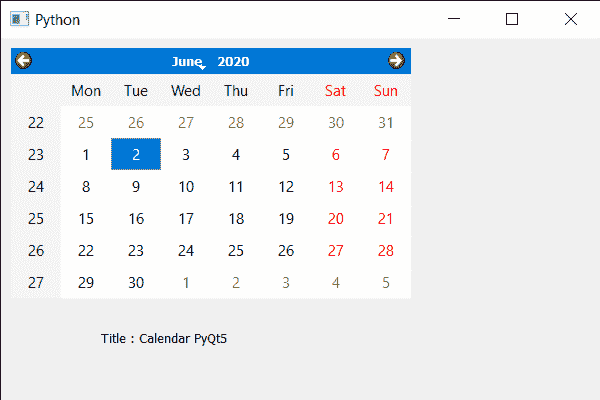

# PyQt5 QCalendarWidget–获取标题

> 原文:[https://www . geeksforgeeks . org/pyqt 5-qcalendarwidget-get-title/](https://www.geeksforgeeks.org/pyqt5-qcalendarwidget-getting-title/)

在本文中，我们将看到如何获得 QCalendarWidget 的标题。标题基本上是 QCalendarWidget 的标题，标题基本上是日历的名称或者关于日历的小提示，我们可以使用`setWindowTitle`方法给它设置标题。

> 为此，我们将对 QCalendarWidget 对象使用`windowTitle`方法。
> 
> **语法:** calendar.windowTitle()
> 
> **论证:**不需要论证
> 
> **返回:**返回字符串

下面是实现

```py
# importing libraries
from PyQt5.QtWidgets import * 
from PyQt5 import QtCore, QtGui
from PyQt5.QtGui import * 
from PyQt5.QtCore import * 
import sys

class Window(QMainWindow):

    def __init__(self):
        super().__init__()

        # setting title
        self.setWindowTitle("Python ")

        # setting geometry
        self.setGeometry(100, 100, 600, 400)

        # calling method
        self.UiComponents()

        # showing all the widgets
        self.show()

    # method for components
    def UiComponents(self):

        # creating a QCalendarWidget object
        calender = QCalendarWidget(self)

        # setting geometry to the calender
        calender.setGeometry(10, 10, 400, 250)

        # title
        title = "Calendar PyQt5"

        # setting title i.e caption
        calender.setWindowTitle(title)

        # creating label
        label = QLabel(self)

        # setting geometry to the label
        label.setGeometry(100, 270, 250, 60)

        # making label multi line
        label.setWordWrap(True)

        # getting title
        value = calender.windowTitle()

        # setting text to the label
        label.setText("Title : " + str(value))

# create pyqt5 app
App = QApplication(sys.argv)

# create the instance of our Window
window = Window()

# start the app
sys.exit(App.exec())
```

**输出:**
