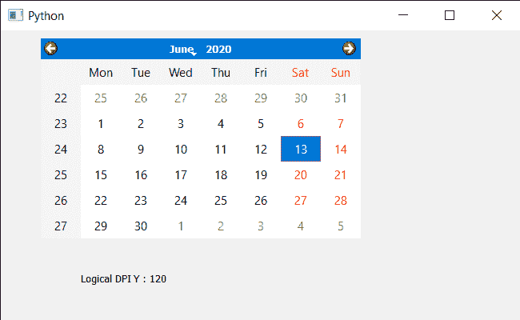

# PyQt5 QCalendarWidget–获得垂直分辨率

> 原文:[https://www . geeksforgeeks . org/pyqt 5-qcalendarwidget-get-vertical-resolution/](https://www.geeksforgeeks.org/pyqt5-qcalendarwidget-getting-vertical-resolution/)

在本文中，我们将了解如何获得 QCalendarWidget 的垂直分辨率。为了做到这一点，我们使用`logicalDpiY`方法，它以每英寸点数返回设备的垂直分辨率，这在计算字体大小时使用。对于 X11，这通常与从 heightMM()计算的结果相同。

> 为此，我们将对 QCalendarWidget 对象使用`logicalDpiY`方法。
> 
> **语法:** calendar.logicalDpiY()
> 
> **论证:**不需要论证
> 
> **返回:**返回整数

下面是实现

```
# importing libraries
from PyQt5.QtWidgets import * 
from PyQt5 import QtCore, QtGui
from PyQt5.QtGui import * 
from PyQt5.QtCore import * 
import sys

# QCalendarWidget Class
class Calendar(QCalendarWidget):

    # constructor
    def __init__(self, parent = None):
        super(Calendar, self).__init__(parent)

class Window(QMainWindow):

    def __init__(self):
        super().__init__()

        # setting title
        self.setWindowTitle("Python ")

        # setting geometry
        self.setGeometry(100, 100, 650, 400)

        # calling method
        self.UiComponents()

        # showing all the widgets
        self.show()

    # method for components
    def UiComponents(self):

        # creating a QCalendarWidget object
        # as Calendar class inherits QCalendarWidget
        self.calendar = Calendar(self)

        # setting geometry to the calender
        self.calendar.setGeometry(50, 10, 400, 250)

        # setting cursor
        self.calendar.setCursor(Qt.PointingHandCursor)

        # creating label to show the properties
        self.label = QLabel(self)

        # setting geometry to the label
        self.label.setGeometry(100, 280, 250, 60)

        # making label multi line
        self.label.setWordWrap(True)

        # getting layout
        value = self.calendar.logicalDpiY()

        # setting text to the label
        self.label.setText("Logical DPI Y : " + str(value))

# create pyqt5 app
App = QApplication(sys.argv)

# create the instance of our Window
window = Window()

# start the app
sys.exit(App.exec())
```

**输出:**
