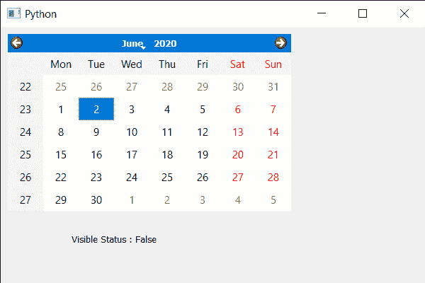

# PyQt5 QCalendarWidget–获取可见属性状态

> 原文:[https://www . geesforgeks . org/pyqt5-qcalendarwidget-get-visible-property-status/](https://www.geeksforgeeks.org/pyqt5-qcalendarwidget-getting-visible-property-status/)

在本文中，我们将看到如何获得 QCalendarWidget 的可见属性状态，通过使可见属性为 False，我们可以使其不可见。我们可以借助`show`方法使其可见，但该方法不会使其不可见，因此我们使用了可同时实现这两种功能的可见属性。我们可以借助`setVisible`方法设置可见的属性状态。

> 为此，我们将对 QCalendarWidget 对象使用`isVisible`方法。
> 
> **语法:** calendar.isVisible()
> 
> **论证:**不需要论证
> 
> **返回:**返回 bool

下面是实现

```
# importing libraries
from PyQt5.QtWidgets import * 
from PyQt5 import QtCore, QtGui
from PyQt5.QtGui import * 
from PyQt5.QtCore import * 
import sys

class Window(QMainWindow):

    def __init__(self):
        super().__init__()

        # setting title
        self.setWindowTitle("Python ")

        # setting geometry
        self.setGeometry(100, 100, 600, 400)

        # calling method
        self.UiComponents()

        # showing all the widgets
        self.show()

    # method for components
    def UiComponents(self):

        # creating a QCalendarWidget object
        calender = QCalendarWidget(self)

        # setting geometry to the calendar
        calender.setGeometry(10, 10, 400, 250)

        # setting visible property
        calender.setVisible(True)

        # creating label
        label = QLabel(self)

        # setting geometry to the label
        label.setGeometry(100, 270, 250, 60)

        # making label multi line
        label.setWordWrap(True)

        # getting visible property status
        value = calender.isVisible()

        # setting text to the label
        label.setText("Visible Status : " + str(value))

# create pyqt5 app
App = QApplication(sys.argv)

# create the instance of our Window
window = Window()

# start the app
sys.exit(App.exec())
```

**输出:**
