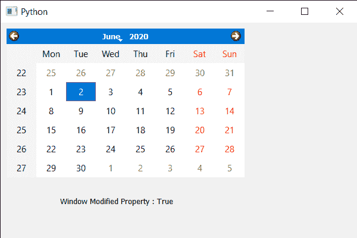

# PyQt5 QCalendarWidget–获取窗口修改属性

> 原文:[https://www . geesforgeks . org/pyqt5-qcalendarwidget-get-window-modified-property/](https://www.geeksforgeeks.org/pyqt5-qcalendarwidget-getting-window-modified-property/)

在本文中，我们将看到如何获得 QCalendarWidget 的窗口修改属性。窗口修改属性保存窗口中显示的日历是否有未保存的更改，默认情况下，该属性为假，尽管我们可以借助`setWindowModified`方法更改该属性。

**注意:**如果一个 QCalendarWidget 被设置为已修改，那么它的所有祖先也会被设置为已修改。

> 为此，我们将对 QCalendarWidget 对象使用`isWindowModified`方法。
> 
> **语法:** calendar.isWindowModified()
> 
> **论证:**不需要论证
> 
> **返回:**返回 bool

下面是实现

```
# importing libraries
from PyQt5.QtWidgets import * 
from PyQt5 import QtCore, QtGui
from PyQt5.QtGui import * 
from PyQt5.QtCore import * 
import sys

class Window(QMainWindow):

    def __init__(self):
        super().__init__()

        # setting title
        self.setWindowTitle("Python ")

        # setting geometry
        self.setGeometry(100, 100, 600, 400)

        # calling method
        self.UiComponents()

        # showing all the widgets
        self.show()

    # method for components
    def UiComponents(self):

        # creating a QCalendarWidget object
        calender = QCalendarWidget(self)

        # setting geometry to the calender
        calender.setGeometry(10, 10, 400, 250)

        # setting window modified property
        calender.setWindowModified(True)

        # creating label
        label = QLabel(self)

        # setting geometry to the label
        label.setGeometry(100, 270, 250, 60)

        # making label multi line
        label.setWordWrap(True)

        # getting window modified property
        value = calender.isWindowModified()

        # setting text to the label
        label.setText("Window Modified Property : " + str(value))

# create pyqt5 app
App = QApplication(sys.argv)

# create the instance of our Window
window = Window()

# start the app
sys.exit(App.exec())
```

**输出:**
