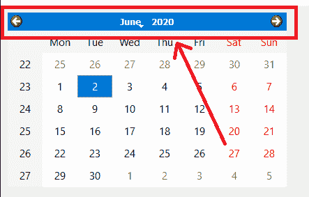
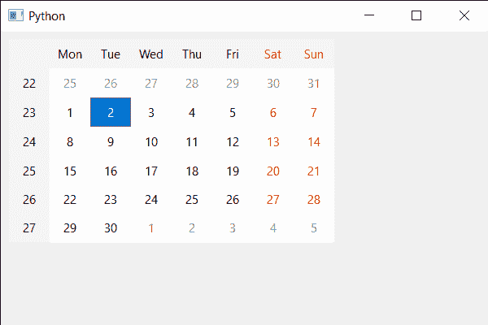

# PyQt5 QCalendarWidget–隐藏导航栏

> 原文:[https://www . geesforgeks . org/pyqt5-qcalendarwidget-hiding-the-导航栏/](https://www.geeksforgeeks.org/pyqt5-qcalendarwidget-hiding-the-navigation-bar/)

在本文中，我们将看到如何隐藏 QCalendarWidget 的导航栏。导航栏是日历的顶部，用于更改下个月、上个月、月份选择、年份选择。默认情况下，导航栏是可见的，尽管我们可以随时隐藏它，下面是 QCalendarWidget 的导航栏表示。



> 为此，我们将对 QCalendarWidget 对象使用`setNavigationBarVisible`方法。
> 
> **语法:**calendar . setnavigationbar visible(False)
> 
> **自变量:**它以布尔为自变量
> 
> **返回:**返回无

下面是实现

```py
# importing libraries
from PyQt5.QtWidgets import * 
from PyQt5 import QtCore, QtGui
from PyQt5.QtGui import * 
from PyQt5.QtCore import * 
import sys

class Window(QMainWindow):

    def __init__(self):
        super().__init__()

        # setting title
        self.setWindowTitle("Python ")

        # setting geometry
        self.setGeometry(100, 100, 600, 400)

        # calling method
        self.UiComponents()

        # showing all the widgets
        self.show()

    # method for components
    def UiComponents(self):

        # creating a QCalendarWidget object
        calender = QCalendarWidget(self)

        # setting geometry to the calender
        calender.setGeometry(10, 10, 400, 250)

        # hiding the navigation bar
        calender.setNavigationBarVisible(False)

# create pyqt5 app
App = QApplication(sys.argv)

# create the instance of our Window
window = Window()

# start the app
sys.exit(App.exec())
```

**输出:**
