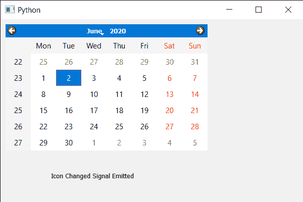

# PyQt5 QCalendarWidget–图标更改信号

> 原文:[https://www . geesforgeks . org/pyqt 5-qcalendarwidget-icon-changed-signal/](https://www.geeksforgeeks.org/pyqt5-qcalendarwidget-icon-changed-signal/)

在本文中，我们将看到如何从 QCalendarWidget 获取图标更改信号。当日历图标改变时，会发出图标改变信号。设置图标也发出同样的信号。

> 为此，我们将对 QCalendarWidget 对象使用`windowIconChanged`方法。
> 
> **语法:**calendar . windowiconchanded . connect(lambda:print(“图标已更改”))
> 
> **论证:**不需要论证
> 
> **执行的操作:**每当发出信号时，它将打印信息

下面是实现

```py
# importing libraries
from PyQt5.QtWidgets import * 
from PyQt5 import QtCore, QtGui
from PyQt5.QtGui import * 
from PyQt5.QtCore import * 
import sys

class Window(QMainWindow):

    def __init__(self):
        super().__init__()

        # setting title
        self.setWindowTitle("Python ")

        # setting geometry
        self.setGeometry(100, 100, 600, 400)

        # calling method
        self.UiComponents()

        # showing all the widgets
        self.show()

    # method for components
    def UiComponents(self):

        # creating a QCalendarWidget object
        calender = QCalendarWidget(self)

        # setting geometry to the calender
        calender.setGeometry(10, 10, 400, 250)

        # creating a label
        label = QLabel(self)

        # setting geometry to the label
        label.setGeometry(100, 280, 250, 60)

        # making label multi line
        label.setWordWrap(True)

        # text
        text = "Icon Changed Signal Emitted"

        # getting the icon changed and
        # when receives the signal printing the message
        calender.windowIconChanged.connect(lambda: label.setText(text))

        # setting icon to the calendar
        calender.setWindowIcon(QIcon('logo.png'))

# create pyqt5 app
App = QApplication(sys.argv)

# create the instance of our Window
window = Window()

# start the app
sys.exit(App.exec())
```

**输出:**
