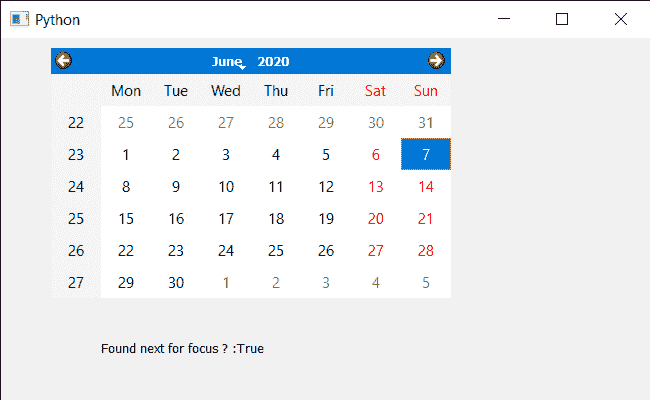

# PyQt5 QCalendarWidget–将焦点转移到下一个孩子身上

> 原文:[https://www . geeksforgeeks . org/pyqt 5-qcalendarwidget-making-focus-to-next-child/](https://www.geeksforgeeks.org/pyqt5-qcalendarwidget-making-focus-to-next-child/)

在本文中，我们将看到如何将焦点放在 QCalendarWidget 的下一个小部件上。为了做到这一点，我们使用`focusNextChild`方法。它会找到一个新的小部件来赋予键盘焦点，这对于 Tab 来说是合适的，如果它能找到新的小部件，则返回 true，否则返回 false。

> 为此，我们将对 QCalendarWidget 对象使用`focusNextChild`方法。
> 
> **语法:** calendar.focusNextChild()
> 
> **论证:**不需要论证
> 
> **返回:**返回 bool

下面是实现

```
# importing libraries
from PyQt5.QtWidgets import * 
from PyQt5 import QtCore, QtGui
from PyQt5.QtGui import * 
from PyQt5.QtCore import * 
import sys

class Window(QMainWindow):

    def __init__(self):
        super().__init__()

        # setting title
        self.setWindowTitle("Python ")

        # setting geometry
        self.setGeometry(100, 100, 650, 400)

        # calling method
        self.UiComponents()

        # showing all the widgets
        self.show()

    # method for components
    def UiComponents(self):

        # creating a QCalendarWidget object
        self.calender = QCalendarWidget(self)

        # setting geometry to the calendar
        self.calender.setGeometry(50, 10, 400, 250)

        # setting cursor
        self.calender.setCursor(Qt.PointingHandCursor)

        # creating label to show the properties
        self.label = QLabel(self)

        # setting geometry to the label
        self.label.setGeometry(100, 280, 250, 60)

        # making label multi line
        self.label.setWordWrap(True)

        # focus next child
        value = self.calender.focusNextChild()

        # setting text to the label
        self.label.setText("Found next for focus ? :" + str(value))

# create pyqt5 app
App = QApplication(sys.argv)

# create the instance of our Window
window = Window()

# start the app
sys.exit(App.exec())
```

**输出:**
