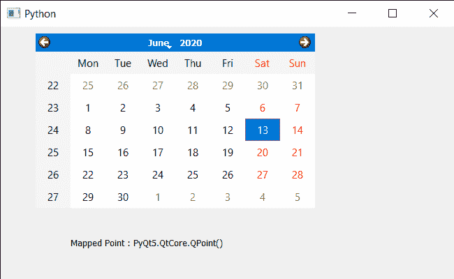

# PyQt5 QCalendarWidget–将坐标系映射到日历坐标系

> 原文:[https://www . geeksforgeeks . org/pyqt 5-qcalendar widget-制图-坐标系到日历-坐标系/](https://www.geeksforgeeks.org/pyqt5-qcalendarwidget-mapping-co-ordinate-system-to-calendar-co-ordinate-system/)

在本文中，我们将看到如何映射 QCalendarWidget 的坐标系。为了做到这一点，我们使用 mapFrom 方法，这将日历坐标位置从父代的坐标系转换到这个小部件的坐标系。父代不能是无，并且必须是调用小部件的父代。

> 为此，我们将对 QCalendarWidget 对象使用 mapFrom 方法。
> **语法:** calendar.mapFrom(父，点)
> **参数:**它以作为父的 QWidget 对象和 QPoint 对象作为参数
> **返回:**它返回 QPoint 对象

下面是实现

## 蟒蛇 3

```py
# importing libraries
from PyQt5.QtWidgets import *
from PyQt5 import QtCore, QtGui
from PyQt5.QtGui import *
from PyQt5.QtCore import *
import sys

# QCalendarWidget Class
class Calendar(QCalendarWidget):

    # constructor
    def __init__(self, parent = None):
        super(Calendar, self).__init__(parent)

class Window(QMainWindow):

    def __init__(self):
        super().__init__()

        # setting title
        self.setWindowTitle("Python ")

        # setting geometry
        self.setGeometry(100, 100, 650, 400)

        # calling method
        self.UiComponents()

        # showing all the widgets
        self.show()

    # method for components
    def UiComponents(self):

        # creating a QCalendarWidget object
        # as Calendar class inherits QCalendarWidget
        self.calendar = Calendar(self)

        # setting geometry to the calender
        self.calendar.setGeometry(50, 10, 400, 250)

        # setting cursor
        self.calendar.setCursor(Qt.PointingHandCursor)

        # creating label to show the properties
        self.label = QLabel(self)

        # setting geometry to the label
        self.label.setGeometry(100, 280, 250, 60)

        # making label multi line
        self.label.setWordWrap(True)

        # mapping to widget co-ordinate system
        value = self.calendar.mapFrom(self, QPoint(50, 10))

        # setting text to the label
        self.label.setText("Mapped Point : " + str(value))

# create pyqt5 app
App = QApplication(sys.argv)

# create the instance of our Window
window = Window()

# start the app
sys.exit(App.exec())
```

**输出:**

