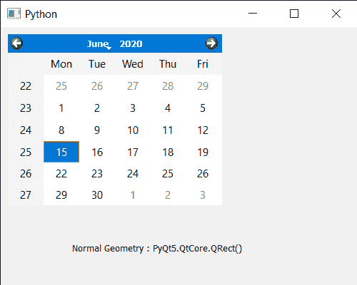

# PyQt5 QCalendarWidget–正常几何属性

> 原文:[https://www . geeksforgeeks . org/pyqt 5-qcalendar widget-normal-geometry-property/](https://www.geeksforgeeks.org/pyqt5-qcalendarwidget-normal-geometry-property/)

在本文中，我们将看到如何获得 QCalendarWidget 的法线几何属性。此属性保存日历的几何图形，当它显示为普通(非最大化或全屏)顶级小部件时会出现。对于日历的孩子，此属性始终保持一个空矩形。

> 为此，我们将对 QCalendarWidget 对象使用`normalGeometry`方法。
> 
> **语法:** calendar.normalGeometry()
> 
> **论证:**不需要论证
> 
> **返回:**返回对象

下面是实现

```
# importing libraries
from PyQt5.QtWidgets import * 
from PyQt5 import QtCore, QtGui
from PyQt5.QtGui import * 
from PyQt5.QtCore import * 
import sys

# QCalendarWidget Class
class Calendar(QCalendarWidget):

    # constructor
    def __init__(self, parent = None):
        super(Calendar, self).__init__(parent)

class Window(QMainWindow):

    def __init__(self):
        super().__init__()

        # setting title
        self.setWindowTitle("Python ")

        # setting geometry
        self.setGeometry(100, 100, 500, 400)

        # calling method
        self.UiComponents()

        # showing all the widgets
        self.show()

    # method for components
    def UiComponents(self):

        # creating a QCalendarWidget object
        # as Calendar class inherits QCalendarWidget
        self.calendar = Calendar(self)

        # setting cursor
        self.calendar.setCursor(Qt.PointingHandCursor)

        # setting size of the calendar
        self.calendar.resize(300, 240)

        # move the calendar
        self.calendar.move(10, 10)

        # creating a label
        label = QLabel(self)

        # setting geometry to the label
        label.setGeometry(100, 280, 250, 60)

        # making label multi line
        label.setWordWrap(True)

        # getting the normal geometry
        value = self.calendar.normalGeometry()

        # setting text to the label
        label.setText("Normal Geometry : " + str(value))

# create pyqt5 app
App = QApplication(sys.argv)

# create the instance of our Window
window = Window()

# start the app
sys.exit(App.exec())
```

**输出:**
