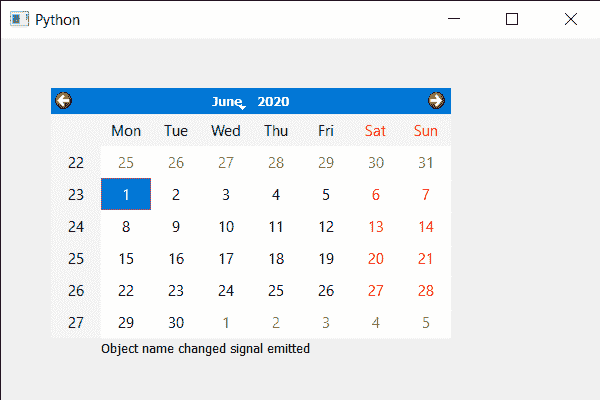

# PyQt5 QCalendarWidget–对象名称更改信号

> 原文:[https://www . geesforgeks . org/pyqt 5-qcalendarwidget-object-name-changed-signal/](https://www.geeksforgeeks.org/pyqt5-qcalendarwidget-object-name-changed-signal/)

在本文中，我们将看到如何从 QCalendarWidget 获取对象名称更改信号。对象名称更改信号在对象名称更改后发出。新对象名作为对象名传递。
**注:**这是私人信号。它可以用于信号连接，但不能由用户发出。

> 为此，我们将对 QCalendarWidget 对象使用 objectNameChanged 方法。
> **语法:**calendar . Object name changed . connect(lambda:print(“对象名称更改信号信号”))
> **引数:**它以方法为引数
> **执行的动作:**只要发出激活信号，它就会打印消息

下面是实现

## 蟒蛇 3

```py
# importing libraries
from PyQt5.QtWidgets import *
from PyQt5 import QtCore, QtGui
from PyQt5.QtGui import *
from PyQt5.QtCore import *
import sys

class Window(QMainWindow):

    def __init__(self):
        super().__init__()

        # setting title
        self.setWindowTitle("Python ")

        # setting geometry
        self.setGeometry(100, 100, 600, 400)

        # calling method
        self.UiComponents()

        # showing all the widgets
        self.show()

    # method for components
    def UiComponents(self):

        # creating a QCalendarWidget object
        self.calendar = QCalendarWidget(self)

        # setting geometry to the calendar
        self.calendar.setGeometry(50, 50, 400, 250)

        # creating a label
        label = QLabel(self)

        # setting geometry to the label
        label.setGeometry(100, 280, 250, 60)

        # making label multi line
        label.setWordWrap(True)

        # text
        text = "Object name changed signal emitted"

        # getting the object name changed signal
        self.calendar.objectNameChanged.connect(lambda: label.setText(text))

        # changing object name
        self.calendar.setObjectName("New Name")

# create pyqt5 app
App = QApplication(sys.argv)

# create the instance of our Window
window = Window()

# start the app
sys.exit(App.exec())
```

**输出:**

