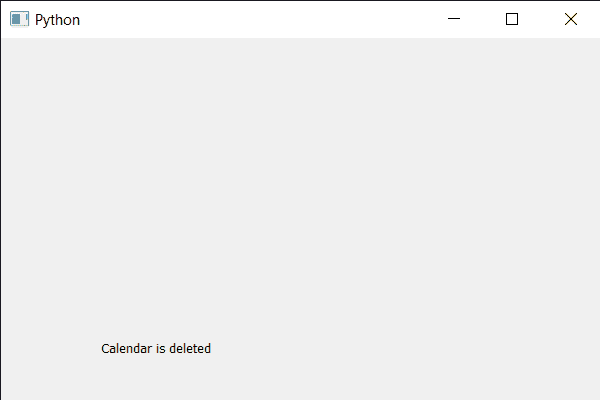

# PyQt5 QCalendarWidget–删除内存引用

> 原文:[https://www . geeksforgeeks . org/pyqt 5-qcalendarwidget-remove-memory-reference/](https://www.geeksforgeeks.org/pyqt5-qcalendarwidget-removing-memory-reference/)

在本文中，我们将看到如何删除 QCalendarWidget 的引用。删除日历对象的最后一个 Python 引用不足以完全清理，因为 Qt 端可能还有一个引用。一般来说，Qt 倾向于不隐式删除对象。因此，如果内存使用令人担忧，可能需要采取措施明确删除它们。

> 为此，我们将对 QCalendarWidget 对象使用 deleteLater 方法。
> **语法:**calendar . delete late()
> **参数:**不需要参数
> **返回:**返回 None

下面是实现

## 蟒蛇 3

```
# importing libraries
from PyQt5.QtWidgets import *
from PyQt5 import QtCore, QtGui
from PyQt5.QtGui import *
from PyQt5.QtCore import *
import sys

class Window(QMainWindow):

    def __init__(self):
        super().__init__()

        # setting title
        self.setWindowTitle("Python ")

        # setting geometry
        self.setGeometry(100, 100, 600, 400)

        # calling method
        self.UiComponents()

        # showing all the widgets
        self.show()

    # method for components
    def UiComponents(self):

        # creating a QCalendarWidget object
        calendar = QCalendarWidget(self)

        # setting geometry to the calendar
        calendar.setGeometry(10, 10, 400, 250)

        # deleting the memory reference explicitly
        calendar.deleteLater()

        # creating a label
        label = QLabel(self)

        # setting geometry to the label
        label.setGeometry(100, 280, 250, 60)

        # making label multi line
        label.setWordWrap(True)

        # setting text to the label
        label.setText("Calendar is deleted")

# create pyqt5 app
App = QApplication(sys.argv)

# create the instance of our Window
window = Window()

# start the app
sys.exit(App.exec())
```

**输出:**

