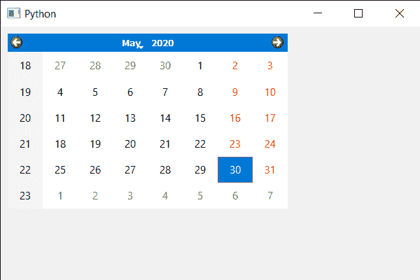

# PyQt5 QCalendarWidget–移除水平标题

> 原文:[https://www . geeksforgeeks . org/pyqt 5-qcalendarwidget-移除水平标题/](https://www.geeksforgeeks.org/pyqt5-qcalendarwidget-removing-the-horizontal-header/)

在本文中，我们将看到如何删除 QCalendarWidget 的水平标题格式。水平标题是 QCalendarWidget 中显示日期名称的地方，默认情况下显示日期的短形式，例如，周一显示为周一，下面是水平标题表示。


> 为此，我们将对 QCalendarWidget 对象使用 setHorizontalHeaderFormat 方法。
> **语法:**calendar . sethorizontalheaderformat(0)
> **参数:**它以水平标题格式作为参数，但传递 0 作为参数将删除水平标题
> **返回:**它不返回

下面是实现

## 蟒蛇 3

```
# importing libraries
from PyQt5.QtWidgets import *
from PyQt5 import QtCore, QtGui
from PyQt5.QtGui import *
from PyQt5.QtCore import *
import sys

class Window(QMainWindow):

    def __init__(self):
        super().__init__()

        # setting title
        self.setWindowTitle("Python ")

        # setting geometry
        self.setGeometry(100, 100, 600, 400)

        # calling method
        self.UiComponents()

        # showing all the widgets
        self.show()

    # method for components
    def UiComponents(self):

        # creating a QCalendarWidget object
        calendar = QCalendarWidget(self)

        # setting geometry to the calendar
        calendar.setGeometry(10, 10, 400, 250)

        # removing horizontal header
        calendar.setHorizontalHeaderFormat(0)

# create pyqt5 app
App = QApplication(sys.argv)

# create the instance of our Window
window = Window()

# start the app
sys.exit(App.exec())
```

**输出:**

