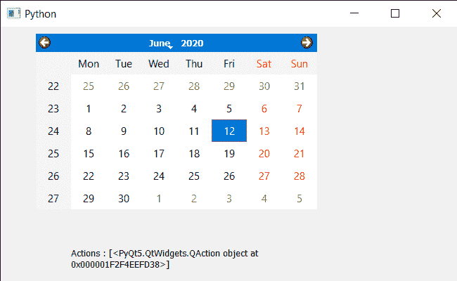

# PyQt5 QCalendarWidget–设置动作事件

> 原文:[https://www . geeksforgeeks . org/pyqt 5-qcalendarwidget-setting-action-event/](https://www.geeksforgeeks.org/pyqt5-qcalendarwidget-setting-action-event/)

在本文中，我们将看到如何实现 QCalendarWidget 的操作事件。每当日历的操作发生更改时，都会用给定的事件调用此事件处理程序。这个事件处理程序可以在子类中重新实现，以接收在事件参数中传递的日历动作事件。
下面是日历类代码

```
# QCalendarWidget Class
class Calendar(QCalendarWidget):

    # constructor
    def __init__(self, parent=None):
        super(Calendar, self).__init__(parent)

    # overriding the actionEvent method
    def actionEvent(self, event):

        # printing the text
        print("Action Changed")
```

> 实施步骤:
> 1。创建一个继承 QCalendarWidget
> 2 的日历类。在日历类中覆盖动作事件，在事件中打印文本
> 3。创建主窗口类
> 4。在主窗口
> 5 内创建一个日历对象。设置日历的各种属性
> 6。添加动作和删除日历的动作

下面是实现

## 蟒蛇 3

```
# importing libraries
from PyQt5.QtWidgets import *
from PyQt5 import QtCore, QtGui
from PyQt5.QtGui import *
from PyQt5.QtCore import *
import sys

# QCalendarWidget Class
class Calendar(QCalendarWidget):

    # constructor
    def __init__(self, parent = None):
        super(Calendar, self).__init__(parent)

    # overriding the actionEvent method
    def actionEvent(self, event):

        # printing the text
        print("Action Changed")

class Window(QMainWindow):

    def __init__(self):
        super().__init__()

        # setting title
        self.setWindowTitle("Python ")

        # setting geometry
        self.setGeometry(100, 100, 650, 400)

        # calling method
        self.UiComponents()

        # showing all the widgets
        self.show()

    # method for components
    def UiComponents(self):

        # creating a QCalendarWidget object
        # as Calendar class inherits QCalendarWidget
        self.calendar = Calendar(self)

        # setting geometry to the calendar
        self.calendar.setGeometry(50, 10, 400, 250)

        # setting cursor
        self.calendar.setCursor(Qt.PointingHandCursor)

        # creating a QAction objects
        action1 = QAction("Geek", self)
        action2 = QAction("Python", self)

        # creating action list
        action_list = [action1, action2]

        # adding actions to calendar
        self.calendar.addActions(action_list)

        # removing action
        self.calendar.removeAction(action1)

        # creating label to show the properties
        self.label = QLabel(self)

        # setting geometry to the label
        self.label.setGeometry(100, 280, 300, 100)

        # making label multi line
        self.label.setWordWrap(True)

        # getting action of the calendar
        value = self.calendar.actions()

        # setting text to the label
        self.label.setText("Actions : " + str(value))

# create pyqt5 app
App = QApplication(sys.argv)

# create the instance of our Window
window = Window()

# start the app
sys.exit(App.exec())
```

**输出:**

```
Action Changed
Action Changed
Action Changed
```



“操作已更改”打印了三次，因为添加了两个操作，删除了一个操作。