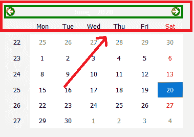

# PyQt5 QCalendarWidget–为导航栏设置边框

> 原文:[https://www . geeksforgeeks . org/pyqt5-qcalendarwidget-设置-边框到导航栏-2/](https://www.geeksforgeeks.org/pyqt5-qcalendarwidget-setting-border-to-the-navigation-bar-2/)

在本文中，我们将看到如何为 QCalendarWidget 的导航栏设置边框。在日历导航栏中，顶部的栏由一些按钮组成，将边框设置为 QCalendarWidget 不同于将边框设置为其他小部件，日历是有多个子部件的小部件，即我们也可以将边框设置为独立部件。下面是带有边框的导航栏的外观



为此，我们将对 QCalendarWidget 对象使用`setStyleSheet`方法，下面是样式表代码

```
QCalendarWidget QWidget#qt_calendar_navigationbar
{
border : 4px solid green;
}

```

下面是实现

```
# importing libraries
from PyQt5.QtWidgets import * from PyQt5 import QtCore, QtGui
from PyQt5.QtGui import * from PyQt5.QtCore import * import sys

# QCalendarWidget Class
class Calendar(QCalendarWidget):

    # constructor
    def __init__(self, parent = None):
        super(Calendar, self).__init__(parent)

class Window(QMainWindow):

    def __init__(self):
        super().__init__()

        # setting title
        self.setWindowTitle("Python ")

        # setting geometry
        self.setGeometry(100, 100, 500, 400)

        # calling method
        self.UiComponents()

        # showing all the widgets
        self.show()

    # method for components
    def UiComponents(self):

        # creating a QCalendarWidget object
        # as Calendar class inherits QCalendarWidget
        self.calendar = Calendar(self)

        # setting cursor
        self.calendar.setCursor(Qt.PointingHandCursor)

        # setting size of the calendar
        self.calendar.resize(350, 240)

        # move the calendar
        self.calendar.move(10, 10)

        # setting stylesheet
        # adding border to the navigation bar
        self.calendar.setStyleSheet("QCalendarWidget QWidget# qt_calendar_navigationbar"
                                    "{"
                                    "border : 4px solid green;"
                                    "}")

# create pyqt5 app
App = QApplication(sys.argv)

# create the instance of our Window
window = Window()

# start the app
sys.exit(App.exec())
```

**输出:**

<video class="wp-video-shortcode" id="video-436573-1" width="640" height="512" preload="metadata" controls=""><source type="video/mp4" src="https://media.geeksforgeeks.org/wp-content/uploads/20200620013931/Python-2020-06-20-01-37-27.mp4?_=1">[https://media.geeksforgeeks.org/wp-content/uploads/20200620013931/Python-2020-06-20-01-37-27.mp4](https://media.geeksforgeeks.org/wp-content/uploads/20200620013931/Python-2020-06-20-01-37-27.mp4)</video>