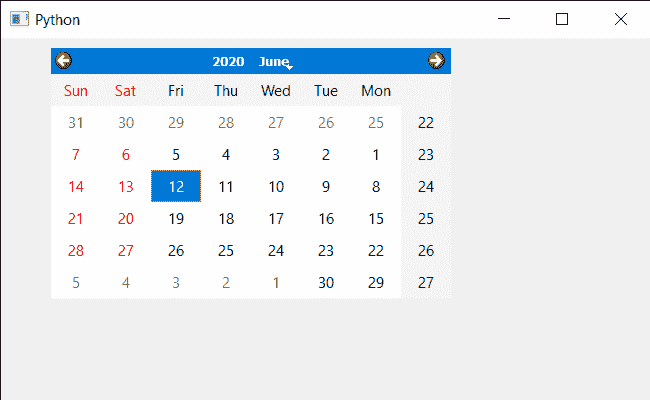

# PyQt5 QCalendarWidget–设置更改事件

> 原文:[https://www . geeksforgeeks . org/pyqt 5-qcalendarwidget-setting-change-event/](https://www.geeksforgeeks.org/pyqt5-qcalendarwidget-setting-change-event/)

在本文中，我们将看到如何实现 QCalendarWidget 的变更事件。可以重新实现该事件处理程序来处理状态更改。可以通过提供的事件检索此事件中正在更改的状态。状态变化可以是布局方向、语言变化等。

下面是日历类代码

```py
# QCalendarWidget Class
class Calendar(QCalendarWidget):

    # constructor
    def __init__(self, parent=None):
        super(Calendar, self).__init__(parent)

    # overriding the changeEvent method
    def changeEvent(self, event):

        # setting text to the label
        print("Change Event Called")

```

> 实施步骤:
> 1。创建一个继承 QCalendarWidget
> 2 的日历类。在日历类中覆盖变更事件，在事件中打印文本
> 3。创建主窗口类
> 4。在主窗口
> 5 内创建一个日历对象。设置日历的各种属性
> 6。更改日历的方向

下面是实现

```py
# importing libraries
from PyQt5.QtWidgets import * 
from PyQt5 import QtCore, QtGui
from PyQt5.QtGui import * 
from PyQt5.QtCore import * 
import sys

# QCalendarWidget Class
class Calendar(QCalendarWidget):

    # constructor
    def __init__(self, parent = None):
        super(Calendar, self).__init__(parent)

    # overriding the changeEvent method
    def changeEvent(self, event):

        # setting text to the label
        print("Change Event Called")

class Window(QMainWindow):

    def __init__(self):
        super().__init__()

        # setting title
        self.setWindowTitle("Python ")

        # setting geometry
        self.setGeometry(100, 100, 650, 400)

        # calling method
        self.UiComponents()

        # showing all the widgets
        self.show()

    # method for components
    def UiComponents(self):

        # creating a QCalendarWidget object
        # as Calendar class inherits QCalendarWidget
        self.calendar = Calendar(self)

        # setting geometry to the calender
        self.calendar.setGeometry(50, 10, 400, 250)

        # setting cursor
        self.calendar.setCursor(Qt.PointingHandCursor)

        # setting direction right to left
        self.calendar.setLayoutDirection(1)

# create pyqt5 app
App = QApplication(sys.argv)

# create the instance of our Window
window = Window()

# start the app
sys.exit(App.exec())
```

**输出:**

```py
Change Event Called
```

