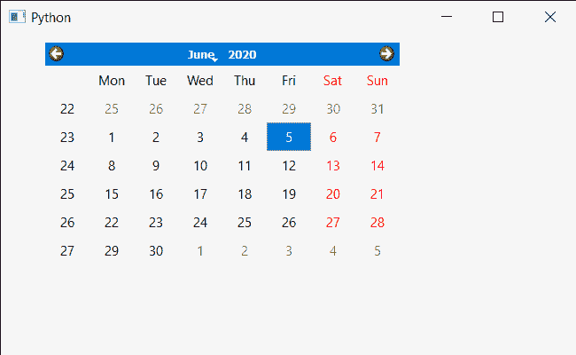

# PyQt5 QCalendarWidget–为其设置上下文菜单策略

> 原文:[https://www . geeksforgeeks . org/pyqt 5-qcalendarwidget-设置-上下文菜单-策略到 it/](https://www.geeksforgeeks.org/pyqt5-qcalendarwidget-setting-context-menu-policy-to-it/)

在本文中，我们将看到如何为 QCalendarWidget 设置上下文菜单策略。上下文菜单策略告诉日历如何显示上下文菜单，有许多策略可用于日历，如 NoContextMenu、PreventContextMenu 等。默认情况下，日历将默认上下文菜单作为上下文策略。

> 为此，我们将对 QCalendarWidget 对象使用`setContextMenuPolicy`方法。
> 
> **语法:**calendar . set context menu policy(Qt)。NoContextMenu)
> 
> **参数:**以内容菜单策略对象为参数
> 
> **返回:**不返回

下面是实现

```
# importing libraries
from PyQt5.QtWidgets import * 
from PyQt5 import QtCore, QtGui
from PyQt5.QtGui import * 
from PyQt5.QtCore import * 
import sys

class Window(QMainWindow):

    def __init__(self):
        super().__init__()

        # setting title
        self.setWindowTitle("Python ")

        # setting geometry
        self.setGeometry(100, 100, 650, 400)

        # calling method
        self.UiComponents()

        # showing all the widgets
        self.show()

    # method for components
    def UiComponents(self):

        # creating a QCalendarWidget object
        self.calender = QCalendarWidget(self)

        # setting geometry to the calender
        self.calender.setGeometry(50, 10, 400, 250)

        # setting context menu policy
        self.calender.setContextMenuPolicy(Qt.NoContextMenu)

# create pyqt5 app
App = QApplication(sys.argv)

# create the instance of our Window
window = Window()

# start the app
sys.exit(App.exec())
```

**输出:**
