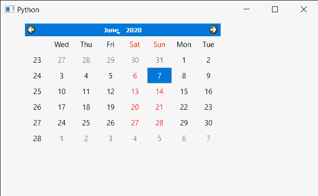

# PyQt5 QCalendarWidget–设置一周的第一天

> 原文:[https://www . geeksforgeeks . org/pyqt 5-qcalendarwidget-设置-一周的第一天/](https://www.geeksforgeeks.org/pyqt5-qcalendarwidget-setting-first-day-of-week/)

在本文中，我们将看到如何将一周的第一天设置为 QCalendarWidget。默认情况下，当我们创建日历时，一周的第一天是星期一，尽管我们可以随时更改，但日期会显示在日历的第一列。

> 为此，我们将对 QCalendarWidget 对象使用 setFirstDayOfWeek 方法。
> **语法:**calendar . setfirst dayofweek(Qt。周三)
> **自变量:**以日为自变量
> **返回:**不返回

下面是实现

## 蟒蛇 3

```
# importing libraries
from PyQt5.QtWidgets import *
from PyQt5 import QtCore, QtGui
from PyQt5.QtGui import *
from PyQt5.QtCore import *
import sys

class Window(QMainWindow):

    def __init__(self):
        super().__init__()

        # setting title
        self.setWindowTitle("Python ")

        # setting geometry
        self.setGeometry(100, 100, 650, 400)

        # calling method
        self.UiComponents()

        # showing all the widgets
        self.show()

    # method for components
    def UiComponents(self):

        # creating a QCalendarWidget object
        self.calendar = QCalendarWidget(self)

        # setting geometry to the calendar
        self.calendar.setGeometry(50, 10, 400, 250)

        # setting cursor
        self.calendar.setCursor(Qt.PointingHandCursor)

        # setting first day of week
        self.calendar.setFirstDayOfWeek(Qt.Wednesday)

# create pyqt5 app
App = QApplication(sys.argv)

# create the instance of our Window
window = Window()

# start the app
sys.exit(App.exec())
```

**输出:**

