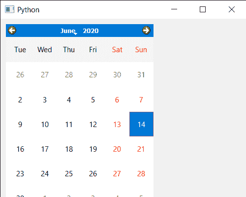

# PyQt5 QCalendarWidget–设置固定宽度

> 原文:[https://www . geeksforgeeks . org/pyqt 5-qcalendarwidget-setting-fixed-width/](https://www.geeksforgeeks.org/pyqt5-qcalendarwidget-setting-fixed-width/)

在本文中，我们将看到如何设置 QCalendarWidget 的固定宽度。日历的固定宽度就是这个宽度，默认情况下，当我们在布局中创建日历时，当窗口扩展或缩小时，日历的大小也会增加或缩小，因此，需要设置固定宽度。

> 为此，我们将对 QCalendarWidget 对象使用`setFixedWidth`方法。
> 
> **语法:**calendar . setfixedwdth(300)
> 
> **自变量:**以整数为自变量
> 
> **返回:**不返回

下面是实现

```
# importing libraries
from PyQt5.QtWidgets import * 
from PyQt5 import QtCore, QtGui
from PyQt5.QtGui import * 
from PyQt5.QtCore import * 
import sys

# QCalendarWidget Class
class Calendar(QCalendarWidget):

    # constructor
    def __init__(self, parent = None):
        super(Calendar, self).__init__(parent)
        self.setMouseTracking(True)

class Window(QMainWindow):

    def __init__(self):
        super().__init__()

        # setting title
        self.setWindowTitle("Python ")

        # setting geometry
        self.setGeometry(100, 100, 500, 400)

        # calling method
        self.UiComponents()

        # showing all the widgets
        self.show()

    # method for components
    def UiComponents(self):

        # creating a layout
        layout = QVBoxLayout()

        # creating a QCalendarWidget object
        # as Calendar class inherits QCalendarWidget
        self.calendar = Calendar(self)

        # setting cursor
        self.calendar.setCursor(Qt.PointingHandCursor)

        # adding calendar tot he layout
        layout.addWidget(self.calendar)

        # setting fixed width
        self.calendar.setFixedWidth(300)

        # setting layout
        widget = QWidget()
        widget.setLayout(layout)
        self.setCentralWidget(widget)

# create pyqt5 app
App = QApplication(sys.argv)

# create the instance of our Window
window = Window()

# start the app
sys.exit(App.exec())
```

**输出:**
