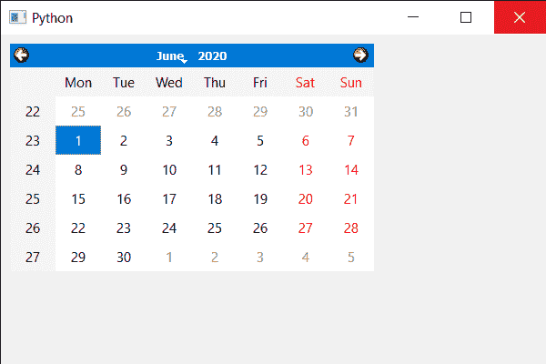

# PyQt5 QCalendarWidget–设置焦点

> 原文:[https://www . geeksforgeeks . org/pyqt 5-qcalendarwidget-setting-focus/](https://www.geeksforgeeks.org/pyqt5-qcalendarwidget-setting-focus/)

在本文中，我们将看到如何将焦点设置到 QCalendarWidget。设置焦点基本上是设置焦点原因有很多焦点原因可用，如后退标签，弹出原因等。设置焦点是重载函数。

> 为此，我们将对 QCalendarWidget 对象使用`setFocus`方法。
> 
> **语法:**calendar . setfocus(Qt。NoFocusReason)
> 
> **自变量:**以 Focus 原因对象为自变量
> 
> **返回:**不返回

下面是实现

```
# importing libraries
from PyQt5.QtWidgets import * 
from PyQt5 import QtCore, QtGui
from PyQt5.QtGui import * 
from PyQt5.QtCore import * 
import sys

class Window(QMainWindow):

    def __init__(self):
        super().__init__()

        # setting title
        self.setWindowTitle("Python ")

        # setting geometry
        self.setGeometry(100, 100, 600, 400)

        # calling method
        self.UiComponents()

        # showing all the widgets
        self.show()

    # method for components
    def UiComponents(self):

        # creating a QCalendarWidget object
        calender = QCalendarWidget(self)

        # setting geometry to the calender
        calender.setGeometry(10, 10, 400, 250)

        # setting focus
        calender.setFocus(Qt.NoFocusReason)

# create pyqt5 app
App = QApplication(sys.argv)

# create the instance of our Window
window = Window()

# start the app
sys.exit(App.exec())
```

**输出:**
