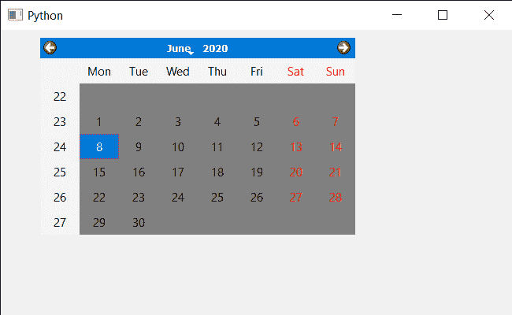

# PyQt5 QCalendarWidget–设置前台角色

> 原文:[https://www . geeksforgeeks . org/pyqt 5-qcalendarwidget-设置-前台-角色/](https://www.geeksforgeeks.org/pyqt5-qcalendarwidget-setting-foreground-role/)

在本文中，我们将看到如何将前台角色设置为 QCalendarWidget。日历中的角色基本上有两种，一种是前台，一种是后台。前景角色定义日历调色板中用于绘制前景的颜色。如果未设置明确的前台角色，前台将返回一个与后台角色形成对比的角色。

> 为此，我们将对 QCalendarWidget 对象使用 setForegroundRole 方法。
> **语法:**calendar . setforegroundrole(color _ object)
> **参数:**取 QPalette。ColorRole 对象参数
> **返回:**它不返回

下面是实现

## 蟒蛇 3

```
# importing libraries
from PyQt5.QtWidgets import *
from PyQt5 import QtCore, QtGui
from PyQt5.QtGui import *
from PyQt5.QtCore import *
import sys

class Window(QMainWindow):

    def __init__(self):
        super().__init__()

        # setting title
        self.setWindowTitle("Python ")

        # setting geometry
        self.setGeometry(100, 100, 650, 400)

        # calling method
        self.UiComponents()

        # showing all the widgets
        self.show()

    # method for components
    def UiComponents(self):
        # creating a QCalendarWidget object
        self.calendar = QCalendarWidget(self)

        # setting geometry to the calendar
        self.calendar.setGeometry(50, 10, 400, 250)

        # setting cursor
        self.calendar.setCursor(Qt.PointingHandCursor)

        # setting foreground role
        self.calendar.setForegroundRole(QPalette.Base)

        # getting palette and setting color to the background to it
        p = self.calendar.palette()
        p.setColor(self.calendar.foregroundRole(), Qt.darkGray)
        self.calendar.setPalette(p)

# create pyqt5 app
App = QApplication(sys.argv)

# create the instance of our Window
window = Window()

# start the app
sys.exit(App.exec())
```

**输出:**

