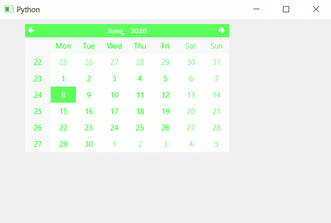

# PyQt5 QCalendarWidget–设置图形效果

> 原文:[https://www . geeksforgeeks . org/pyqt 5-qcalendarwidget-设置-图形-效果/](https://www.geeksforgeeks.org/pyqt5-qcalendarwidget-setting-graphics-effect/)

在本文中，我们将看到如何为 QCalendarWidget 设置图形效果。图形效果是可以在精灵或舞台上使用的效果，以某种方式改变它们的外观。图形效果可以是彩色阴影任何东西。

> 为此，我们将对 QCalendarWidget 对象使用`setGraphicsEffect`方法。
> 
> **语法:** calendar.setGraphicsEffect(效果)
> 
> **自变量:**它以 QGraphicEffect 对象为自变量
> 
> **返回:**不返回

**注意:**此功能将对日历本身及其所有子代应用效果。

下面是实现

```
# importing libraries
from PyQt5.QtWidgets import * 
from PyQt5 import QtCore, QtGui
from PyQt5.QtGui import * 
from PyQt5.QtCore import * 
import sys

class Window(QMainWindow):

    def __init__(self):
        super().__init__()

        # setting title
        self.setWindowTitle("Python ")

        # setting geometry
        self.setGeometry(100, 100, 650, 400)

        # calling method
        self.UiComponents()

        # showing all the widgets
        self.show()

    # method for components
    def UiComponents(self):

        # creating a QCalendarWidget object
        self.calendar = QCalendarWidget(self)

        # setting geometry to the calender
        self.calendar.setGeometry(50, 10, 400, 250)

        # setting cursor
        self.calendar.setCursor(Qt.PointingHandCursor)

        # creating a color graphic effect
        color = QGraphicsColorizeEffect()
        color.setColor(Qt.green)

        # setting graphics to the calendar
        self.calendar.setGraphicsEffect(color)

# create pyqt5 app
App = QApplication(sys.argv)

# create the instance of our Window
window = Window()

# start the app
sys.exit(App.exec())
```

**输出:**
