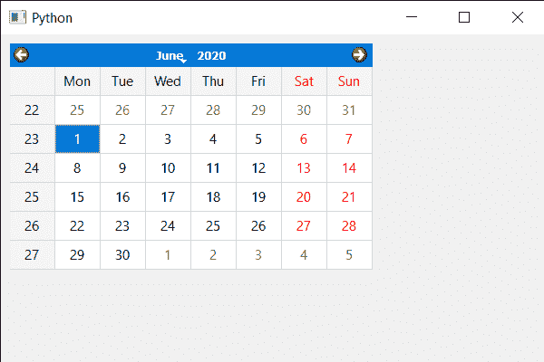

# PyQt5 QCalendarWidget–设置网格

> 原文:[https://www . geeksforgeeks . org/pyqt 5-qcalendarwidget-setting-grid/](https://www.geeksforgeeks.org/pyqt5-qcalendarwidget-setting-grid/)

在本文中，我们将看到如何在 QCalendarWidget 中设置网格。网格基本上是将日期相互分开的相互连接的线网。默认情况下，QCalendarWidget 没有网格，尽管我们可以随时设置网格。下面是带有网格的日历的外观。


> 为此，我们将对 QCalendarWidget 对象使用 setGridVisible 方法。
> **语法:**calendar . setgridvisible(True)
> **自变量:**它以 bool 为自变量
> **返回:**它不返回

下面是实现

## 蟒蛇 3

```
# importing libraries
from PyQt5.QtWidgets import *
from PyQt5 import QtCore, QtGui
from PyQt5.QtGui import *
from PyQt5.QtCore import *
import sys

class Window(QMainWindow):

    def __init__(self):
        super().__init__()

        # setting title
        self.setWindowTitle("Python ")

        # setting geometry
        self.setGeometry(100, 100, 600, 400)

        # calling method
        self.UiComponents()

        # showing all the widgets
        self.show()

    # method for components
    def UiComponents(self):

        # creating a QCalendarWidget object
        calendar = QCalendarWidget(self)

        # setting geometry to the calendar
        calendar.setGeometry(10, 10, 400, 250)

        # setting grid
        calendar.setGridVisible(True)

# create pyqt5 app
App = QApplication(sys.argv)

# create the instance of our Window
window = Window()

# start the app
sys.exit(App.exec())
```

**输出:**

