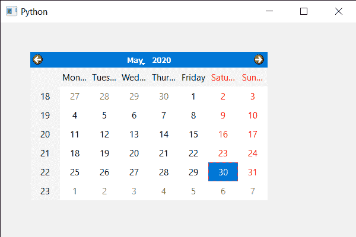

# PyQt5 QCalendarWidget–设置水平表头格式

> 原文:[https://www . geesforgeks . org/pyqt5-qcalendarwidget-设置-水平-页眉-格式/](https://www.geeksforgeeks.org/pyqt5-qcalendarwidget-setting-horizontal-header-format/)

在本文中，我们将看到如何设置 QCalendarWidget 的水平标题格式。水平标题是 QCalendarWidget 中显示日期名称的位置，默认情况下显示的是日期的短形式。例如，周一显示为周一，下面是水平标题表示。


水平标题有多种格式，如 SingleLetterDayNames，它的值是 1，这种格式只显示一天名称的第一个字母，ShortDayNames，这是默认格式，它的值是 2，这种格式只显示一天名称的短形式。LongDayNames 它的值是 3，这种格式显示一天的整个名称。

> 为此，我们对 QCalendarWidget 对象
> **使用 setHorizontalHeaderFormat 方法语法:**calendar . setHorizontalHeaderFormat(格式)
> **参数:**它以水平标题格式作为参数
> **返回:**它不返回

下面是实现

## 蟒蛇 3

```py
# importing libraries
from PyQt5.QtWidgets import *
from PyQt5 import QtCore, QtGui
from PyQt5.QtGui import *
from PyQt5.QtCore import *
import sys

class Window(QMainWindow):

    def __init__(self):
        super().__init__()

        # setting title
        self.setWindowTitle("Python ")

        # setting geometry
        self.setGeometry(100, 100, 600, 400)

        # calling method
        self.UiComponents()

        # showing all the widgets
        self.show()

    # method for components
    def UiComponents(self):

        # creating a QCalendarWidget object
        calendar = QCalendarWidget(self)

        # setting geometry to the calendar
        calendar.setGeometry(50, 50, 400, 250)

        # setting calendar horizontal header format
        calendar.setHorizontalHeaderFormat(QCalendarWidget.LongDayNames)

# create pyqt5 app
App = QApplication(sys.argv)

# create the instance of our Window
window = Window()

# start the app
sys.exit(App.exec())
```

**输出:**

