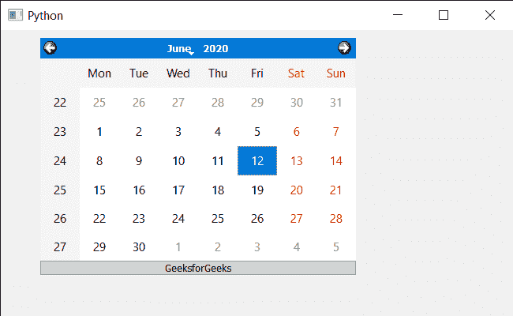

# PyQt5 QCalendarWidget–设置其布局

> 原文:[https://www . geeksforgeeks . org/pyqt 5-qcalendarwidget-setting-its-layout/](https://www.geeksforgeeks.org/pyqt5-qcalendarwidget-setting-its-layout/)

在本文中，我们将看到如何为 QCalendarWidget 设置布局。为了做到这一点，我们使用了 setLayout 方法，如果日历上已经安装了一个布局管理器，QWidget 不会让我们安装另一个。我们必须先删除或更新现有的布局管理器(由 layout()返回)，然后才能用新布局调用 setLayout()。

> 为此，我们将对 QCalendarWidget 对象使用 setLayout 方法。
> **语法:**calendar . setlayout(layout)
> **参数:**它以 QLayout 对象为参数
> **返回:**它不返回

**实施步骤:**
1。创建主窗口
2。创建一个日历部件并设置几何图形
3。获取日历的布局
4。创建标签并设置其属性
5。使用 addWidget 方法
6 将此标签添加到布局中。将此布局设置回日历

下面是实现

## 蟒蛇 3

```py
# importing libraries
from PyQt5.QtWidgets import *
from PyQt5 import QtCore, QtGui
from PyQt5.QtGui import *
from PyQt5.QtCore import *
import sys

class Window(QMainWindow):

    def __init__(self):
        super().__init__()

        # setting title
        self.setWindowTitle("Python ")

        # setting geometry
        self.setGeometry(100, 100, 650, 400)

        # calling method
        self.UiComponents()

        # showing all the widgets
        self.show()

    # method for components
    def UiComponents(self):

        # creating a QCalendarWidget object
        self.calendar = QCalendarWidget(self)

        # setting geometry to the calendar
        self.calendar.setGeometry(50, 10, 400, 300)

        # setting cursor
        self.calendar.setCursor(Qt.PointingHandCursor)

        # getting the current lay out
        layout = self.calendar.layout()

        # creating a label
        label = QLabel("GeeksforGeeks", self)

        # setting alignment
        label.setAlignment(Qt.AlignCenter)

        # setting style sheet to the label
        label.setStyleSheet("QLabel"
                            "{"
                            "border : 1px solid darkgrey;"
                            "background : lightgrey;"
                            "}")

        # adding label to the layout
        layout.addWidget(label)

        # setting layout back to calendar
        self.calendar.setLayout(layout)

# create pyqt5 app
App = QApplication(sys.argv)

# create the instance of our Window
window = Window()

# start the app
sys.exit(App.exec())
```

**输出:**

