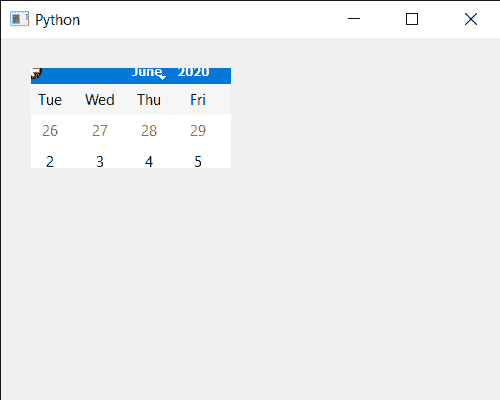

# PyQt5 QCalendarWidget–设置掩码

> 原文:[https://www . geeksforgeeks . org/pyqt 5-qcalendarwidget-setting-mask/](https://www.geeksforgeeks.org/pyqt5-qcalendarwidget-setting-mask/)

在本文中，我们将看到如何为 QCalendarWidget 设置掩码。蒙版基本上都是用来隐藏日历的，借助蒙版用户将无法看到整个日历虽然日历还会存在但上面会有蒙版。

它仅使位图具有相应 1 位的日历像素可见。如果该区域包含日历矩形之外的像素，则该区域中的窗口系统控件可能可见，也可能不可见，具体取决于平台。

> 为此，我们将对 QCalendarWidget 对象使用`setMask`方法。
> 
> **语法:** calendar.setMask(区域)
> 
> **参数:**它以 QRegion 对象或 QBitMap 对象为参数
> 
> **返回:**不返回

下面是实现

```py
# importing libraries
from PyQt5.QtWidgets import * 
from PyQt5 import QtCore, QtGui
from PyQt5.QtGui import * 
from PyQt5.QtCore import * 
import sys

# QCalendarWidget Class
class Calendar(QCalendarWidget):

    # constructor
    def __init__(self, parent = None):
        super(Calendar, self).__init__(parent)
        self.setMouseTracking(True)

class Window(QMainWindow):

    def __init__(self):
        super().__init__()

        # setting title
        self.setWindowTitle("Python ")

        # setting geometry
        self.setGeometry(100, 100, 500, 400)

        # calling method
        self.UiComponents()

        # showing all the widgets
        self.show()

    # method for components
    def UiComponents(self):

        # creating a QCalendarWidget object
        # as Calendar class inherits QCalendarWidget
        self.calendar = Calendar(self)

        # setting cursor
        self.calendar.setCursor(Qt.PointingHandCursor)

        # setting geometry to the calendar
        self.calendar.setGeometry(20, 20, 300, 240)

        # QRect object
        rect = QRect(10, 10, 200, 100)

        # creating a QRegion
        region = QRegion(rect)

        # setting mask to the calendar
        self.calendar.setMask(region)

# create pyqt5 app
App = QApplication(sys.argv)

# create the instance of our Window
window = Window()

# start the app
sys.exit(App.exec())
```

**输出:**
